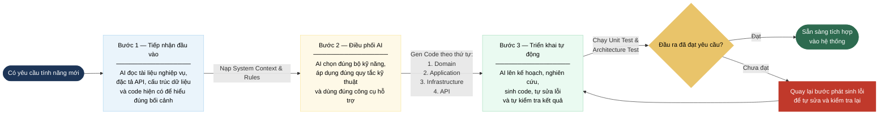

# GovDocs — Quy trình Sử dụng AI để Gen Code Backend .NET Tự động

> - **Dự án:** Hệ thống quản lý văn bản (GovDocs)
> - **Mục tiêu:** Quy trình chuẩn dùng Claude Code để sinh code backend .NET 8 tự động — có governance, đúng kiến trúc, đúng nghiệp vụ

---

## 1. Bức tranh vận hành tổng thể



| Bước vận hành | Mục đích | Kết quả |
|---|---|---|
| **Bước 1 — Tiếp nhận đầu vào** | AI hiểu đúng yêu cầu và bối cảnh hệ thống trước khi làm | Không sinh code sai yêu cầu, sai cấu trúc hoặc sai ngữ cảnh |
| **Bước 2 — Điều phối AI** | AI được dẫn hướng bằng bộ kỹ năng và bộ quy tắc kỹ thuật của dự án | Code sinh ra bám sát kiến trúc .NET 8, Clean Architecture, CQRS và security rules |
| **Bước 3 — Triển khai tự động** | AI tự thực hiện toàn bộ vòng đời tạo code, sửa lỗi và kiểm tra | Đầu ra hoàn chỉnh, sẵn sàng review và tích hợp |

## 2. Bước 1 — Tiếp nhận đầu vào

AI phải nạp đủ 4 nguồn ngữ cảnh trước khi bắt đầu sinh code bất kỳ tính năng nào.

### 4 câu hỏi kiểm tra trước khi chuyển sang Bước tiếp theo

| # | Câu hỏi | Sai lầm phổ biến nếu bỏ qua |
|---|---|---|
| 1 | Tính năng này thực sự cần làm gì, phục vụ nghiệp vụ nào? | AI viết đúng kỹ thuật nhưng sai mục tiêu |
| 2 | API cần nhận gì, trả gì, và tuân theo contract nào? | Sinh sai DTO, sai route hoặc sai format lỗi |
| 3 | Dữ liệu nằm ở đâu, liên quan bảng nào, và cần bảo vệ tenant thế nào? | Bỏ sót query filter, migration hoặc security boundary |
| 4 | Dự án hiện tại đang tổ chức code theo convention nào? | Tạo code lạc quẻ, khó review và khó bảo trì |

---

## 3. Bước 2 — Điều phối AI

Sau khi có đủ ngữ cảnh, AI áp dụng **Skills** và **Rules** để định hướng sinh code.
---

## 2. Bước 1 — Tiếp nhận đầu vào

AI phải nạp đủ 4 nguồn ngữ cảnh trước khi bắt đầu sinh code bất kỳ tính năng nào.

| Nguồn đầu vào | Nội dung | AI cần hiểu gì |
|---|---|---|
| **Tài liệu nghiệp vụ** (SRS · PRD · Use Case) | Mô tả yêu cầu, luồng xử lý, quy tắc nghiệp vụ | Tính năng cần làm là gì, đâu là business rule, đâu chỉ là validation |
| **Đặc tả kỹ thuật API** (Swagger · OpenAPI) | Contract request/response, route, versioning, format lỗi | Dữ liệu vào ra thế nào, API trả lỗi theo chuẩn nào, cần xác thực header gì |
| **Cấu trúc cơ sở dữ liệu** (DB Schema · Migrations) | Entity model, quan hệ bảng, tenant model, index | Bảng nào liên quan, cách tổ chức dữ liệu đa đơn vị, chiến lược cập nhật schema |
| **Code dự án hiện có** (Legacy Codebase) | Cấu trúc thư mục, cách đặt tên, pattern đang dùng | Convention của dự án để không tạo code lạc quẻ với hệ thống |

### 4 câu hỏi kiểm tra trước khi chuyển sang Bước tiếp theo

| # | Câu hỏi | Sai lầm phổ biến nếu bỏ qua |
|---|---|---|
| 1 | Tác vụ này là Domain modeling, Write, Read hay Event? | AI sinh sai loại artifact |
| 2 | Thuộc bounded context nào, namespace là gì? | Code bị đặt sai thư mục |
| 3 | Write dùng EF Core hay Read dùng Dapper? | Trộn lẫn 2 luồng, sai CQRS |
| 4 | Cần tenant isolation, authorization, idempotency không? | Bỏ sót security boundary |
| 5 | Cần thêm test, logging, event, migration ở đâu? | Đầu ra thiếu, không production-ready |

---

## 3. Bước 2 — Điều phối AI

Sau khi có đủ ngữ cảnh, AI áp dụng **Skills** và **Rules** để định hướng sinh code.

### 3.1. Bộ Kỹ năng — Lệnh sinh code theo loại tác vụ

| Loại tác vụ | Skill sử dụng | Code được tạo ra |
|---|---|---|
| Khởi tạo bounded context mới | `/setup-error-handling` `/setup-dependency-injection` `/setup-configuration` | Hạ tầng nền: xử lý lỗi, cấu hình DI, pipeline |
| Mô hình hóa nghiệp vụ cốt lõi | `/generate-domain-entity` | Aggregate Root, Value Objects, Domain Events, cấu hình DB, Repository |
| Tạo tính năng ghi dữ liệu | `/generate-command` | Command, Handler, Validator, API action ghi |
| Tạo tính năng đọc dữ liệu | `/generate-query` | Query, Handler Dapper, DTO, API action đọc |
| Xử lý sự kiện từ service khác | `/add-event-handler` | Consumer, kiểm tra trùng lặp, hàng đợi lỗi |
| Xử lý bất đồng bộ đáng tin cậy | `/setup-background-job` | Outbox Processor, bảng ProcessedMessages |
| Tối ưu hiệu năng đọc | `/setup-caching` | Redis config, CacheKeys, Repository decorator |

### 3.2. Bộ Quy tắc — Chuẩn kỹ thuật AI bắt buộc tuân thủ

Rules được nhúng sẵn vào AI thông qua `CLAUDE.md` và `ai-rules/*.md`. AI không được phép vi phạm dù ở bất kỳ skill nào.

| # | Quy tắc | Nguồn AI Rule | Hậu quả nếu vi phạm |
|---|---|---|---|
| 1 | Domain không import EF Core / Dapper / MassTransit | `ai-rules/01-clean-architecture.md` | Domain bị lệ thuộc hạ tầng, không test được |
| 2 | Write → EF Core + Change Tracking / Read → Dapper + SQL thuần | `ai-rules/02-cqrs-pattern.md` | Trộn luồng, hiệu năng read kém, Change Tracker rác |
| 3 | TenantId chỉ lấy từ JWT claim | `ai-rules/03-security-tenancy.md` | Nguy cơ tenant giả mạo, lỗ hổng bảo mật |
| 4 | Global Query Filter bắt buộc cho mọi `ITenantEntity` | `ai-rules/03-security-tenancy.md` | Rò rỉ dữ liệu cross-tenant |
| 5 | Cache key phải prefix `tenant:{tenantId}:` | `ai-rules/12-caching.md` | Đọc nhầm dữ liệu tenant khác |
| 6 | Consumer phải idempotent — check `ProcessedMessages` | `ai-rules/05-resilience.md` | Xử lý trùng khi broker redeliver |
| 7 | Chỉ retry lỗi transient, không retry lỗi business | `ai-rules/05-resilience.md` | Retry loop làm nghẽn hệ thống |
| 8 | Không auto-migrate khi startup production | `ai-rules/08-efcore.md` | Schema change không kiểm soát, downtime |
| 9 | Mọi lỗi HTTP trả theo `ProblemDetails` RFC 7807 | `ai-rules/04-api-contract.md` | Frontend / consumer không parse được lỗi |
| 10 | Integration test dùng Testcontainers, không InMemoryDb | `ai-rules/07-testing.md` | Test pass nhưng production lỗi |

---

## 4. Bước 3 — Triển khai tự động

AI thực thi theo chu trình **5 bước tuần tự**. Bước Self-Fix lặp lại cho đến khi pass hoặc gặp blocker thực sự.

---

### Bước 1 — Planning

AI lập kế hoạch triển khai trước khi viết bất kỳ dòng code nào.

**Checklist Planning:**

- [ ] Xác định loại tác vụ: Domain / Write / Read / Event / Setup
- [ ] Xác định bounded context và namespace đích
- [ ] Liệt kê đúng thứ tự các file cần tạo hoặc sửa
- [ ] Chọn Skill phù hợp cho từng tác vụ
- [ ] Xác định những Rules nào bắt buộc áp dụng
- [ ] Ghi chú những phần cần hỏi lại nếu ngữ cảnh thiếu

---

### Bước 2 — Research

AI nghiên cứu codebase hiện tại để không tạo code lạc quẻ.

**Checklist Research:**

- [ ] Tìm handler tương tự gần nhất trong codebase
- [ ] Xác nhận cấu trúc thư mục: `src/{BoundedContext}/Application/Features/{UseCase}/`
- [ ] Xác nhận namespace convention theo thư mục
- [ ] Tìm cách project đặt tên Controller, Validator, Repository
- [ ] Xác nhận base class đang dùng: `AggregateRoot`, `ValueObject`, `ApiController`
- [ ] Tìm policy authorization tương tự nếu tính năng có bảo mật
- [ ] Đọc EF Core config hiện có để bám theo convention snake_case / column mapping

---

### Bước 3 — Generation

AI sinh code theo đúng skill đã chọn, áp dụng tất cả rules liên quan.

**Checklist Generation — Domain Entity:**

- [ ] Aggregate Root kế thừa `AggregateRoot`, private constructor, `static Create(...)` factory
- [ ] Value Objects kế thừa `ValueObject`, factory method throw `DomainException` nếu invalid
- [ ] Domain Events implement `IDomainEvent`, chỉ chứa snapshot data
- [ ] Implement `ITenantEntity` nếu là multi-tenant entity
- [ ] EF Core Fluent Config: snake_case column names, concurrency token, Global Query Filter
- [ ] Repository interface trong Domain, implementation trong Infrastructure

**Checklist Generation — Command (Write Path):**

- [ ] Command là `record`, implement `IRequest<T>`, chỉ chứa input data
- [ ] Validator kế thừa `AbstractValidator<TCommand>`, chỉ validate format/required
- [ ] Handler pattern: `load aggregate → call domain method → SaveChangesAsync → return result`
- [ ] Handler inject `ICurrentUser`, `ITenantContext` — KHÔNG đọc TenantId từ request body
- [ ] Controller action: `[HttpPost]`, trả `201 Created` kèm `Location` header
- [ ] Thêm `[IdempotencyKey]` nếu command có nguy cơ gửi lặp
- [ ] Authorization: `[Authorize(Policy = "...")]` đúng scope

**Checklist Generation — Query (Read Path):**

- [ ] Query là `record`, implement `IRequest<TResponse>`
- [ ] Handler dùng Dapper thuần, KHÔNG dùng EF Core DbContext
- [ ] SQL bắt buộc có `WHERE tenant_id = @TenantId`
- [ ] Pagination: `page`, `pageSize` (tối đa 100), trả về `totalCount`
- [ ] Response DTO là class/record phẳng, không phải entity
- [ ] Controller action: `[HttpGet]`, trả `200 OK`

**Checklist Generation — Event Handler:**

- [ ] Consumer kế thừa `IConsumer<TEvent>`
- [ ] Đầu Handle: kiểm tra `ProcessedMessages` — nếu đã xử lý thì return ngay
- [ ] Cuối Handle: insert `ProcessedMessages` trong cùng transaction
- [ ] Cấu hình `ConsumerDefinition`: retry chỉ lỗi transient, DLQ cho lỗi business
- [ ] Emit OpenTelemetry span cho mỗi message được xử lý

---

### Bước 4 — Self-Fix

AI tự chạy và sửa lỗi mà không cần can thiệp từ bên ngoài.

**Chu trình Self-Fix:**

```
dotnet build
  → Nếu lỗi: đọc compiler error, sửa code, build lại

dotnet format --verify-no-changes
  → Nếu lỗi: chạy dotnet format, commit format riêng

dotnet test --filter Category=Unit
  → Nếu fail: đọc stack trace, sửa code, test lại

dotnet test --filter Category=Integration
  → Nếu fail: kiểm tra Testcontainers khởi động, SQL đúng không, mapping đúng không

Lặp lại cho đến khi toàn bộ pass
  → Nếu gặp blocker không tự giải quyết được: escalate ra người dùng
```

**Checklist Self-Fix:**

- [ ] Build không có warning CS nào liên quan code AI vừa sinh
- [ ] Format pass — không có file bị flag
- [ ] Unit tests pass cho Handler, Validator, Domain logic
- [ ] Integration tests pass với Testcontainers PostgreSQL / Redis thật
- [ ] Architecture test pass — Domain không reference Infrastructure packages

---

### Bước 5 — Review & Test

Kiểm chứng đầu ra theo đúng technical standards của GovDocs trước khi merge.

**Checklist Review — Architecture:**

- [ ] `Domain` project không có `using` tới EF Core / Dapper / MassTransit
- [ ] Architecture test (`ArchUnit` / `NetArchTest`) xanh hết
- [ ] Mỗi feature nằm đúng thư mục `Features/{UseCase}/`

**Checklist Review — Security:**

- [ ] TenantId lấy từ `ITenantContext`, không từ request body
- [ ] Global Query Filter active cho entity mới
- [ ] Authorization policy đúng scope
- [ ] Không có sensitive data trong log (token, password, nội dung văn bản)

**Checklist Review — API Contract:**

- [ ] Command trả `201 Created` + `Location` header
- [ ] Query trả `200 OK` + pagination
- [ ] Lỗi trả `ProblemDetails` đúng mapping: 422 / 404 / 409 / 502 / 500
- [ ] Route theo pattern `/api/v1/{resource}`

**Checklist Review — Observability:**

- [ ] Mọi log entry có `TenantId`, `UserId`, `CorrelationId`
- [ ] Handler chạy lâu hơn 500ms bị log warning tự động
- [ ] Health check cập nhật nếu có dependency mới

**Checklist Review — EF Core & Migration:**

- [ ] Migration tạo đúng tên: `{Entity}_InitialCreate` hoặc `{Entity}_{Description}`
- [ ] Migration KHÔNG tự chạy khi startup — phải `dotnet ef database update` thủ công
- [ ] Query read-only qua EF Core (nếu có) phải dùng `AsNoTracking()`
- [ ] Optimistic concurrency token có trên entity nghiệp vụ quan trọng

---

## 5. Bộ Kỹ năng × Bộ Quy tắc — Bảng tra cứu nhanh

| Skill | Rules bắt buộc | File sinh ra |
|---|---|---|
| `/generate-domain-entity` | #1 No infra deps · #4 Global Query Filter | Aggregate · Value Objects · Domain Events · EF Config · Repository |
| `/generate-command` | #1 · #2 EF write · #3 TenantId · #9 ProblemDetails | Command · Handler · Validator · Controller action |
| `/generate-query` | #2 Dapper read · #3 TenantId WHERE · #9 Pagination | Query · Dapper Handler · DTO · Controller GET |
| `/setup-error-handling` | #9 Exception hierarchy · ProblemDetails | Exception classes · GlobalExceptionHandler · ProblemDetails factory |
| `/setup-dependency-injection` | #2 MediatR behaviors · service lifetimes | DI extensions · Program.cs · MediatR + Validation pipeline |
| `/setup-configuration` | ValidateOnStart · no hardcode secret | Options class · appsettings section · DI registration |
| `/setup-caching` | #4 #5 Tenant prefix · TTL · Cache-Aside | Redis config · CacheKeys · CachedRepository decorator |
| `/setup-background-job` | #6 ProcessedMessages · #8 No auto-migrate | OutboxProcessor · ProcessedMessages table · BackgroundService |
| `/add-event-handler` | #6 Idempotent · #7 Retry transient · #3 TenantId | Consumer · ConsumerDefinition · DLQ config · Tracing |

---

## 6. Lợi ích chiến lược của mô hình

| Giá trị | Diễn giải |
|---|---|
| **Tăng tốc phát triển** | AI tự động hóa boilerplate, developer tập trung vào business logic |
| **Chuẩn hóa kiến trúc** | Mọi đầu ra tuân thủ cùng một bộ Skills và Rules |
| **Giảm lỗi thiết kế** | Rules ngăn AI sinh code vi phạm Clean Architecture, CQRS, Security |
| **Self-healing workflow** | AI tự build, test, sửa lỗi — giảm vòng lặp can thiệp thủ công |
| **Audit được** | Mọi code sinh bởi AI đều qua checklist rõ ràng, không bypass quy trình |
