# Báo cáo Triển khai: Foundation AI Workflow cho .NET Team

> - **Phạm vi:** Foundation dùng chung cho các dự án .NET sử dụng Claude Code
> - **Mục tiêu:** Mô tả workflow tổng thể khi áp dụng `CLAUDE.md`, `ai-rules/`, skills, commands và agents để sinh code, review code và duy trì chuẩn kiến trúc

---

## 1. Giá trị cốt lõi mang lại (Why we do this)

### 1.1. Việc áp dụng Foundation AI Workflow này giúp giải quyết 3 bài toán lớn của team:

- Single Source of Truth: ai-rules/ là nguồn chân lý duy nhất. AI và Dev cùng soi vào một bộ luật (Clean Architecture, CQRS, Entity Framework) để làm việc, xóa bỏ tình trạng mỗi người code một style.
- Tiết kiệm Token & Thời gian: Context được nạp tự động theo đúng ngữ cảnh (Progressive Disclosure) thay vì nhồi nhét toàn bộ vào một prompt khổng lồ.
- Tăng tốc độ Onboarding: Kỹ sư mới chỉ cần gọi đúng Command/Skill, AI sẽ tự động scaffold ra bộ khung chuẩn xác mà không cần phải review đi review lại nhiều lần.

## 2. Bức tranh vận hành tổng thể

```mermaid
flowchart LR
    START(["Có yêu cầu mới<br/>từ Developer / Team"])

    A["Bước 1 — Nạp Foundation Context<br/>─────────────────<br/>Claude Code tự động đọc CLAUDE.md,<br/>.claude/settings.json, .mcp.json,<br/>skills, commands và agents hiện có"]

    B["Bước 2 — Xác định loại tác vụ<br/>─────────────────<br/>AI phân loại yêu cầu:<br/>• Cần scaffold artifact cụ thể?<br/>• Cần workflow nhiều bước?<br/>• Cần review chuyên sâu?<br/>• Cần kiểm tra rule chuẩn?"]

    C["Bước 3 — Điều phối công cụ AI<br/>─────────────────<br/>AI chọn đúng cơ chế xử lý:<br/>• Skill: sinh artifact cụ thể<br/>• Command: chạy workflow tổng hợp<br/>• Agent: review / design theo concern<br/>• ai-rules: nguồn rule chuẩn duy nhất"]

    D["Bước 4 — Áp dụng AI Rules<br/>─────────────────<br/>AI đọc các file liên quan trong ai-rules/:<br/>Clean Architecture, CQRS, Tenancy,<br/>API Contract, Testing, EF Core,<br/>Caching, Background Jobs..."]

    E["Bước 5 — Thực thi tự động<br/>─────────────────<br/>AI scaffold code, cập nhật file,<br/>review kiến trúc, viết test,<br/>hoặc phân tích chuyên sâu theo yêu cầu"]

    F["Bước 6 — Kiểm tra kết quả<br/>─────────────────<br/>AI chạy hoặc đề xuất build/test/review:<br/>• Build<br/>• Unit / Integration / Architecture Test<br/>• Clean Architecture Review<br/>• Security / EF Core / Test Review"]

    G{"Đạt chuẩn<br/>theo ai-rules?"}

    H(["Sẵn sàng sử dụng<br/>cho project .NET / review / merge"])

    I["Quay lại bước phát sinh lỗi<br/>─────────────────<br/>Sửa code, chỉnh workflow,<br/>bổ sung rule hoặc chọn lại skill/agent<br/>rồi kiểm tra lại"]

    START --> A
    A --> B
    B --> C
    C --> D
    D --> E
    E --> F
    F --> G
    G -- "Đạt" --> H
    G -- "Chưa đạt" --> I
    I --> E

    style START fill:#1d3557,color:#fff,stroke:#1d3557
    style A fill:#eaf4fb,color:#000,stroke:#aed6f1
    style B fill:#fef9e7,color:#000,stroke:#f9e79f
    style C fill:#fdf2e9,color:#000,stroke:#f5cba7
    style D fill:#f4ecf7,color:#000,stroke:#d7bde2
    style E fill:#eafaf1,color:#000,stroke:#a9dfbf
    style F fill:#e8f8f5,color:#000,stroke:#76d7c4
    style G fill:#e9c46a,color:#000,stroke:#e9c46a
    style H fill:#2d6a4f,color:#fff,stroke:#2d6a4f
    style I fill:#c0392b,color:#fff,stroke:#c0392b
```



| Bước vận hành | Mục đích | Kết quả |
|---|---|---|
| **Bước 1 — Nạp Foundation Context** | Claude hiểu repo là foundation dùng chung, không phải project nghiệp vụ đơn lẻ | Claude biết vai trò của `CLAUDE.md`, `.mcp.json`, `.claude/skills`, `.claude/commands`, `.claude/agents` |
| **Bước 2 — Xác định loại tác vụ** | Phân loại yêu cầu để tránh dùng sai công cụ | Biết khi nào dùng skill, command, agent hoặc đọc `ai-rules/` |
| **Bước 3 — Điều phối công cụ AI** | Chọn đúng cơ chế xử lý | Workflow rõ ràng, không prompt dài hoặc sinh code tùy tiện |
| **Bước 4 — Áp dụng AI Rules** | Bảo đảm mọi output bám chuẩn kỹ thuật | `ai-rules/` vẫn là single source of truth |
| **Bước 5 — Thực thi tự động** | Sinh code, viết test, review hoặc phân tích theo yêu cầu | Có đầu ra thực tế phục vụ development |
| **Bước 6 — Kiểm tra kết quả** | Xác nhận code/workflow đạt chuẩn trước khi dùng | Giảm rủi ro vi phạm architecture, security, testing |

---

## 3. Quy ước đọc sơ đồ

| Thành phần | Ý nghĩa |
|---|---|
| **Skill** | Dùng khi cần scaffold artifact cụ thể như Command, Query, Domain Entity, Caching |
| **Command** | Dùng khi cần workflow nhiều bước như tạo feature mới hoặc review Clean Architecture |
| **Agent** | Dùng khi cần review/design chuyên sâu theo một concern như Security, EF Core, Testing |
| **ai-rules/** | Nguồn technical rules chuẩn duy nhất, mọi skill/command/agent phải tham chiếu về đây |


---

## 4. Ví dụ Thực chiến (Case Study)

Tình huống: Cần tạo API GetOrderById.
- Dev ra lệnh: Chạy command claude "Sinh feature GetOrderById".
- AI phân loại: Nhận diện đây là task tạo luồng Query. Nó quyết định dùng Skill query-scaffolder.
- AI đọc Rule: Tự động mở ai-rules/clean-architecture.md và ai-rules/cqrs-mediatr.md để nắm chuẩn.
- AI thực thi:
    - Tạo file GetOrderByIdQuery.cs ở Application layer.
    - Tạo GetOrderByIdQueryHandler.cs gọi trực tiếp vào DB Context (.AsNoTracking()).
    - Cập nhật OrderController.cs ở API layer.
- Hoàn thành: Code tuân thủ 100% chuẩn mà không cần Dev phải hướng dẫn cấu trúc thư mục.

---

## 5. Kết luận

Workflow tổng thể của foundation này là:

```text
Yêu cầu mới
→ Claude nạp context
→ Phân loại tác vụ
→ Chọn skill / command / agent / ai-rules
→ Áp dụng technical rules
→ Thực thi tự động
→ Kiểm tra kết quả
→ Đạt chuẩn thì dùng, chưa đạt thì sửa và kiểm tra lại
```

Nguyên tắc quan trọng nhất: **`ai-rules/` là nguồn rule chuẩn duy nhất; skills, commands và agents chỉ là cơ chế thực thi hoặc review dựa trên các rules đó.**
