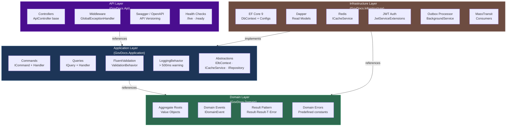

# GovDocs — Core Backend Architecture Overview

> - **Dự án:** Hệ thống quản lý văn bản
> - **Mục tiêu tài liệu:** Nghiên cứu cấu trúc và triển khai core BE mới trên nền tảng .NET 8

---

## 1. Executive Summary

GovDocs được định hướng như một **core backend dùng chung** cho hệ thống quản lý văn bản, xây dựng trên:

- **.NET 8** cho nền tảng dịch vụ backend
- **EF Core 9 + PostgreSQL** cho write model và quản trị dữ liệu nghiệp vụ
- **Dapper** cho read model hiệu năng cao
- **Redis** cho distributed caching
- **MassTransit + RabbitMQ** cho tích hợp event-driven
- **OpenTelemetry + Serilog** cho logging, tracing và observability

Kiến trúc lựa chọn là:

- **Clean Architecture** để tách biệt nghiệp vụ với hạ tầng
- **Pragmatic DDD** cho các bounded context cốt lõi
- **CQRS** để tách riêng luồng đọc/ghi
- **Event-Driven Integration** để sẵn sàng mở rộng sang distributed system

---

## 2. Giá trị kiến trúc ở góc nhìn quản trị

### 2.1. Giảm rủi ro phụ thuộc kỹ thuật

Clean Architecture giúp business logic không phụ thuộc trực tiếp vào ORM, cache, broker hay framework hạ tầng. Điều này giúp hệ thống:

- Dễ bảo trì và thay thế công nghệ hạ tầng khi cần
- Giảm chi phí refactor về lâu dài
- Tăng khả năng test độc lập ở tầng nghiệp vụ

### 2.2. Tối ưu cho quy mô lớn

CQRS và Dapper cho phép tối ưu hiệu năng đọc trong bối cảnh hệ thống quản lý văn bản thường có tỷ lệ **đọc cao hơn ghi rất nhiều lần**.

### 2.3. Sẵn sàng mở rộng liên thông

Event-driven architecture với Outbox/Inbox pattern giúp GovDocs có thể:

- Tích hợp với các hệ thống nghiệp vụ khác
- Giảm coupling giữa các service
- Hạn chế cascading failure khi triển khai theo hướng microservices

---

## 3. Kiến trúc phân lớp tổng quan



### Ý nghĩa từng layer

| Layer | Vai trò | Giá trị quản trị |
|---|---|---|
| **Domain** | Chứa quy tắc nghiệp vụ cốt lõi | Giảm lệ thuộc công nghệ, bảo vệ logic nghiệp vụ lâu dài |
| **Application** | Điều phối use case qua Commands/Queries | Chuẩn hóa flow nghiệp vụ, dễ kiểm thử |
| **Infrastructure** | Chứa DB, cache, auth, messaging, background jobs | Đóng gói toàn bộ yếu tố hạ tầng, dễ thay thế / mở rộng |
| **API** | Cung cấp giao diện HTTP cho client / integration | Chuẩn hóa contract tích hợp và bề mặt dịch vụ |

### Quy tắc cốt lõi

> **Dependency rule tuyệt đối:** `Presentation → Application → Domain ← Infrastructure`

Điều này có nghĩa là:

- Domain không biết EF Core là gì
- Application không phụ thuộc trực tiếp Redis, RabbitMQ hay PostgreSQL
- Infrastructure chỉ là lớp thực thi các contract đã được định nghĩa phía trong

Đây là nền tảng để mở rộng hệ thống mà không phá vỡ lõi nghiệp vụ.

---

## 4. Cấu trúc solution ở mức tổng quan

```
GovDocs/
│
├── GovDocs.sln
├── global.json                        ← SDK version pinning
├── Directory.Build.props              ← Shared MSBuild settings
├── Directory.Packages.props           ← Centralized NuGet versions
├── .editorconfig                      ← Code style: file-scoped ns, indent 4
├── .env.example                       ← Template biến môi trường
├── docker-compose.yml                 ← Local: postgres + redis + rabbitmq
├── Dockerfile                         ← Production image (multi-stage)
│
├── src/
│   ├── GovDocs.Domain/                ← Layer 1: Core business (zero deps)
│   │   ├── Primitives/
│   │   │   ├── Entity.cs              ← Base entity + domain events list
│   │   │   ├── AggregateRoot.cs       ← Marks aggregate boundary
│   │   │   └── IDomainEvent.cs
│   │   ├── Common/
│   │   │   ├── Result.cs              ← Railway-oriented Result pattern
│   │   │   ├── Result<T>.cs
│   │   │   ├── Error.cs               ← Error(code, description, type)
│   │   │   └── ErrorType.cs           ← Failure|Validation|NotFound|Conflict
│   │   └── {Feature}/
│   │       ├── {Entity}.cs            ← Aggregate Root (private ctor + factory)
│   │       ├── {ValueObject}.cs       ← Immutable value objects
│   │       ├── Events/                ← Domain events (snapshot data only)
│   │       └── Errors/                ← Predefined domain errors
│   │
│   ├── GovDocs.Application/           ← Layer 2: Use cases, no infra deps
│   │   ├── Abstractions/
│   │   │   ├── Messaging/             ← ICommand, IQuery, ICommandHandler...
│   │   │   ├── Data/                  ← IApplicationDbContext
│   │   │   ├── Caching/               ← ICacheService
│   │   │   └── Behaviors/             ← LoggingBehavior, ValidationBehavior
│   │   ├── {Feature}/
│   │   │   ├── Commands/{UseCase}/    ← Command + Handler + Validator
│   │   │   ├── Queries/{UseCase}/     ← Query + Handler + Response DTO
│   │   │   └── Mappings/              ← Entity → DTO mapping extensions
│   │   └── DependencyInjection.cs     ← AddApplicationServices()
│   │
│   ├── GovDocs.Infrastructure/        ← Layer 3: EF Core, Redis, JWT, Jobs
│   │   ├── Persistence/
│   │   │   ├── ApplicationDbContext.cs
│   │   │   ├── Configurations/        ← Fluent API per entity (snake_case)
│   │   │   ├── Interceptors/          ← UpdateAuditableEntitiesInterceptor
│   │   │   ├── Migrations/            ← Per bounded context, no auto-migrate
│   │   │   └── Repositories/          ← IRepository implementations
│   │   ├── Caching/
│   │   │   ├── CacheService.cs        ← IDistributedCache wrapper
│   │   │   ├── CacheKeys.cs           ← tenant:{id}:{entity}:{id} keys
│   │   │   └── RedisOptions.cs
│   │   ├── Authentication/
│   │   │   ├── JwtOptions.cs
│   │   │   └── JwtServiceExtensions.cs
│   │   ├── BackgroundJobs/
│   │   │   └── OutboxProcessor.cs     ← HostedService, SKIP LOCKED polling
│   │   ├── Outbox/
│   │   │   └── OutboxMessage.cs
│   │   ├── Messaging/
│   │   │   └── Consumers/             ← MassTransit consumers + definitions
│   │   └── DependencyInjection.cs     ← AddInfrastructureServices()
│   │
│   └── GovDocs.Api/                   ← Layer 4: HTTP surface
│       ├── Controllers/
│       │   ├── ApiController.cs       ← Base: ISender injection
│       │   └── {Feature}Controller.cs ← GET / POST / PUT / DELETE
│       ├── Middleware/
│       │   └── GlobalExceptionHandler.cs ← IExceptionHandler → ProblemDetails
│       ├── Extensions/
│       │   └── ResultExtensions.cs    ← Result<T> → IActionResult mapper
│       ├── OpenApi/
│       │   └── ConfigureSwaggerOptions.cs
│       ├── Program.cs                 ← Only calls AddXxxServices()
│       └── appsettings.json
│
└── tests/
    ├── GovDocs.UnitTests/             ← Domain logic, handlers (no DB)
    │   ├── Domain/                    ← Aggregate tests, Result tests
    │   └── Application/               ← Handler tests with NSubstitute
    ├── GovDocs.IntegrationTests/      ← Real PostgreSQL + Redis (Testcontainers)
    │   ├── Infrastructure/            ← WebAppFactory setup
    │   └── {Feature}/                 ← HTTP endpoint tests
    ├── GovDocs.ArchitectureTests/     ← NetArchTest dependency rules
    └── GovDocs.ContractTests/         ← Event schema validation
```

### Ý nghĩa quản trị của cấu trúc test

| Nhóm test | Mục tiêu |
|---|---|
| **Unit Tests** | Bảo vệ business logic độc lập với hạ tầng |
| **Integration Tests** | Kiểm chứng với PostgreSQL / Redis thật |
| **Architecture Tests** | Enforce dependency rule, tránh sai kiến trúc theo thời gian |
| **Contract Tests** | Bảo vệ API contract và event contract giữa các service |

---

## 5. Mô hình triển khai

### 5.1. Monolith có phân chia layer rõ ràng

- Cách triển khai phù hợp nhất cho giai đoạn đầu
- Tách layer rõ ràng để khi mở rộng sang microservices không cần refactor lớn

### 5.2. Multi-tenancy

- **Global Query Filter** trên mọi entity đa tenant
- **TenantId** chỉ lấy từ JWT claim
- Cache key bắt buộc có prefix `tenant:{tenantId}:`

### 5.3. CQRS Implementation

- **Write path**: EF Core với AsNoTracking, migration strategy, concurrency token
- **Read path**: Dapper cho truy vấn phức tạp và hiệu năng cao
- **Separation**: Commands/Queries hoàn toàn tách biệt về handler và response DTO

---

## 6. Mô hình dữ liệu

### 6.1. Write Model (EF Core 9 + PostgreSQL)

- **Hierarchical structure** với `ltree` extension cho cây thư mục
- **Full-text search** tích hợp sẵn trong PostgreSQL
- **Concurrency token** trên các entity chính để tránh lost update

### 6.2. Read Model (Dapper)

- **Denormalized projections** cho các truy vấn phổ biến
- **Materialized views** cho các dashboard metrics
- **Indexes** được tối ưu theo query patterns cụ thể

### 6.3. Caching (Redis)

- **Cache-aside pattern** với TTL phù hợp theo loại dữ liệu
- **Tenant-prefixed keys** để đảm bảo isolation
- **Cache invalidation** khi có write operations

---

## 7. Event-Driven Integration

### 7.1. MassTransit + RabbitMQ

- **Outbox pattern** để đảm bảo eventual consistency
- **Inbox pattern** để consumer idempotent
- **Dead-letter queue** cho failed messages
- **SKIP LOCKED** cho distributed job processing

### 7.2. Domain Events

- **Domain Events** phát sinh từ Aggregate Roots
- **Integration Events** cho giao tiếp giữa bounded contexts
- **Event versioning** để handle schema evolution

---

## 8. Observability

### 8.1. Logging (Serilog)

- **Structured logging** với correlation IDs
- **Log levels** phân biệt rõ ràng theo môi trường
- **Sensitive data masking** tự động

### 8.2. Tracing (OpenTelemetry)

- **Distributed tracing** cho request across services
- **Custom spans** cho business operations
- **Export** sang Jaeger / Zipkin / OTLP

### 8.3. Health Checks

- **Liveness probe**: kiểm tra service còn chạy
- **Readiness probe**: kiểm tra dependencies (DB, Redis, RabbitMQ)
- **Health check endpoint** exposed qua `/health`

---

## 9. Security

### 9.1. Authentication & Authorization

- **JWT Bearer tokens** với claims chứa TenantId, UserId, Roles
- **Policy-based authorization** ở tầng API
- **Row-level security** ở database level (PostgreSQL RLS)

### 9.2. Data Protection

- **Tenant isolation** qua Global Query Filter + Redis key prefix
- **Concurrency control** qua EF Core concurrency tokens
- **Input validation** qua FluentValidation

---

## 10. Resilience Patterns

| Pattern | Implementation |
|---|---|
| **Retry** | Chỉ retry lỗi transient, exponential backoff, circuit breaker |
| **Circuit Breaker** | Polly cho HTTP calls và repository operations |
| **Bulkhead** | Isolated connection pools cho từng dependency |
| **Timeout** | Global timeout policy trên mọi outbound call |
| **Idempotency** | Consumer idempotent qua Inbox table check |

---

## 11. Rủi ro cần lưu ý khi triển khai

| Rủi ro | Mô tả | Hướng kiểm soát |
|---|---|---|
| **Độ phức tạp kiến trúc tăng** | Clean Architecture + CQRS + Event-Driven không phù hợp nếu áp dụng tràn lan cho mọi module nhỏ | Chỉ dùng full pattern cho bounded context cốt lõi |
| **Learning curve cao** | Dev cần hiểu DDD, CQRS, EF Core, Dapper, messaging | Tài liệu hóa + onboarding + code review standards |
| **Chi phí kiểm thử và observability** | Mô hình chuẩn hóa tốt nhưng cần đầu tư test + monitoring từ sớm | Đưa vào backlog nền tảng bắt buộc, không để phát sinh sau |

---

## 12. Khuyến nghị

### 1. Đây là nền tảng dùng chung, không phải chỉ một project đơn lẻ
GovDocs được thiết kế như **core backend chuẩn hóa**, có thể nhân rộng cho nhiều bounded context và service.

### 2. Kiến trúc ưu tiên độ bền lâu dài hơn là tốc độ dựng nhanh ban đầu
Mục tiêu là giảm chi phí bảo trì, tăng tính ổn định và tránh debt kiến trúc về sau.

### 3. Đây là hướng phù hợp nếu hệ thống có lộ trình mở rộng nhiều tenant, nhiều phân hệ, nhiều tích hợp
Nếu chỉ làm CRUD nhỏ, kiến trúc này có thể nặng. Nhưng với hệ thống quản lý văn bản quy mô tổ chức, đây là hướng phù hợp và có tính chiến lược.

---

## 13. Tài liệu tham khảo chi tiết

| Tài liệu | Vai trò |
|---|---|
| `docs/database_architecture.md` | Quyết định về multi-tenancy, ltree, partitioning |
| `docs/design_pattern_architecture.md` | Quyết định về Clean Architecture, DDD, CQRS |
| `docs/distributed_system_design.md` | Quyết định về Dapr, Swarm, Kubernetes |
| `docs/backend_core_technical_guidelines.md` | Technical guardrails cho production-ready backend |
| `docs/govdocs-ai-code-generation.md` | Quy trình sử dụng AI để gen code tự động |

---

## 14. Kết luận

GovDocs là một định hướng kiến trúc backend hiện đại, phù hợp với bài toán hệ thống quản lý văn bản quy mô lớn, đa tenant, cần tích hợp và cần kiểm soát chất lượng phát triển chặt chẽ.

Mô hình này mang lại 3 lợi ích chiến lược:

1. **Chuẩn hóa kiến trúc backend dùng chung**
2. **Tối ưu hiệu năng** cho hệ thống đọc nhiều, ghi ít
3. **Giảm chi phí bảo trì và mở rộng** về dài hạn
