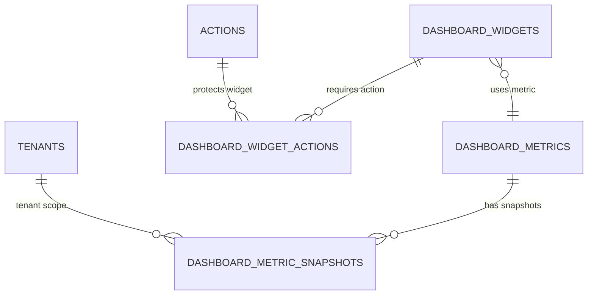

# Thiết kế Dashboard Admin MVP và Dashboard Portal theo mô hình Hierarchical Multi-Tenant

**Ngày cập nhật:** 06/05/2026
**Mục tiêu:** Rút gọn thiết kế dashboard theo hướng MVP thực tế cho hệ thống quản lý văn bản của Bộ Tài chính, dễ triển khai cho nhiều đơn vị, dùng chung common database và tương thích mô hình hierarchical multi-tenant.

---

# 1. Định hướng thiết kế rút gọn

## 1.1. Mục tiêu triển khai thực tế

Thay vì xây một hệ dashboard quá lớn ngay từ đầu, hệ thống nên chia làm 2 khối đủ dùng trước:

1. **Dashboard Admin**: phục vụ cán bộ nội bộ đang vận hành hệ thống.
2. **Dashboard Portal**: phục vụ màn hình tổng quan cấp cổng, thiên về công khai hoặc tổng hợp cấp cao.

## 1.2. Hai khối dashboard nên có

| Khối | Phục vụ ai | Mục tiêu |
|---|---|---|
| **Dashboard Admin** | Văn thư, Lãnh đạo, Quản trị hệ thống | Điều hành và vận hành nội bộ |
| **Dashboard Portal** | Lãnh đạo cấp cao / cổng tổng hợp / có thể mở public một phần | Xem chỉ số tổng quan, minh bạch, theo dõi tiến độ ở mức cổng |

---

# 2. Dashboard Admin MVP

## 2.1. Phạm vi Dashboard Admin MVP

1. **Dashboard Văn thư**
2. **Dashboard Lãnh đạo**
3. **Dashboard Quản trị hệ thống**

---

## 2.2. Dashboard Văn thư

**Actor**
- Văn thư Bộ
- Văn thư đơn vị

### Chức năng thực sự cần có

| Widget / Section | Dữ liệu hiển thị | Hành động |
|---|---|---|
| **Việc hôm nay** | 3 số: VB đến chưa chuyển / VB đi chờ ký / VB quá hạn | Tap số → mở danh sách đã filter |
| **VB đến mới nhất** | 10 VB đến chưa xử lý | Tap → chi tiết VB |
| **Cảnh báo quá hạn** | Chỉ hiện khi VB quá hạn > 0 | Tap → danh sách VB quá hạn |
| **Shortcut nhanh** | Nhận VB mới / Scan VB / Chuyển xử lý | Mở màn hình hiện có |

### Nguồn dữ liệu gắn với hệ thống hiện có

| Dữ liệu | Nguồn chính |
|---|---|
| VB đến chưa chuyển | `IncomingDoc` |
| VB đi chờ ký | `OutgoingDoc` |
| VB quá hạn | `IncomingDoc`, `HandlingDoc`, tùy rule nghiệp vụ hiện hành |
| VB đến mới nhất | `IncomingDoc` |

### KPI tối thiểu

| MetricCode | Ý nghĩa |
|---|---|
| `clerk.incoming.unassigned` | Văn bản đến chưa chuyển xử lý |
| `clerk.outgoing.pending-sign` | Văn bản đi chờ ký |
| `clerk.document.overdue` | Văn bản/công việc quá hạn |

---

## 2.3. Dashboard Lãnh đạo

**Actor**
- Lãnh đạo đơn vị
- Lãnh đạo Bộ / Cục / Vụ / Trung tâm

### Chức năng thực sự cần có

| Widget / Section | Dữ liệu hiển thị | Hành động |
|---|---|---|
| **Inbox ưu tiên** | Danh sách VB/tờ trình cần xử lý, ưu tiên quá hạn → khẩn → mới | Tap → màn hình xử lý |
| **4 số điều hành** | Chờ ký / Chờ duyệt / Quá hạn / Việc hôm nay | Tap số → mở danh sách filter sẵn |
| **Lịch hôm nay** | Lịch công tác / lịch họp trong ngày | Tap → chi tiết lịch |
| **Tiến độ đơn vị** | Tỷ lệ hoàn thành công việc hoặc xử lý VB trong tuần/tháng | Tap → báo cáo tổng hợp |

### Nguồn dữ liệu gắn với hệ thống hiện có

| Dữ liệu | Nguồn chính |
|---|---|
| Chờ ký | `OutgoingDoc`, `HandlingDoc` |
| Chờ duyệt | `Submission`, `SubmissionStep` |
| Quá hạn | `HandlingDoc`, `StaffHandlingDoc`, `IncomingDoc` |
| Lịch hôm nay | `MeetingSchedule`, `WorkSchedule`, `RoomSchedule` |
| Tiến độ đơn vị | `HandlingDoc.Progress`, trạng thái xử lý |

### KPI tối thiểu

| MetricCode | Ý nghĩa |
|---|---|
| `leader.document.pending-sign` | Văn bản chờ ký |
| `leader.submission.pending-approve` | Tờ trình chờ duyệt |
| `leader.task.overdue` | Công việc quá hạn |
| `leader.task.today` | Việc cần xử lý hôm nay |
| `leader.unit.progress-rate` | Tỷ lệ hoàn thành công việc của đơn vị |

---

## 2.4. Dashboard Quản trị hệ thống

**Actor**
- Quản trị hệ thống
- Quản trị tenant

### Chức năng thực sự cần có

| Widget / Section | Dữ liệu hiển thị | Hành động |
|---|---|---|
| **Tenant KPI** | Tổng tenant / tenant active / tenant bị khóa hoặc sai cấu hình cơ bản | Tap → màn hình tenant |
| **User KPI** | Tổng user / user bị khóa / user chưa gán role | Tap → màn hình staff |
| **Permission health** | Role chưa có action / API chưa map action | Tap → màn hình cấu hình quyền |
| **Tổng quan sử dụng** | Số VB đến / VB đi / tờ trình trong kỳ | Tap → drill-down báo cáo |

### Nguồn dữ liệu gắn với hệ thống hiện có

| Dữ liệu | Nguồn chính |
|---|---|
| Tổng tenant | `Tenants` |
| Tổng user / user bị khóa | `Staffs` |
| User chưa có role | `Staffs`, `RoleOfStaffs` |
| Role chưa có action | `Roles`, `ActionRoles` |
| API chưa map action | `Apis`, `ApiActions` |

### KPI tối thiểu

| MetricCode | Ý nghĩa |
|---|---|
| `system.tenant.total` | Tổng tenant |
| `system.tenant.active` | Tenant đang hoạt động |
| `system.staff.total` | Tổng người dùng |
| `system.staff.locked` | Người dùng bị khóa |
| `permission.staff.no-role` | Người dùng chưa có role |
| `permission.role.no-action` | Role chưa có action |
| `permission.api.unmapped` | API chưa map action |

---

## 2.6. Action code Dashboard Admin MVP

| Action Code | Ý nghĩa |
|---|---|
| `dashboard.view` | Quyền xem dashboard cơ bản |
| `dashboard.clerk.view` | Dashboard Văn thư |
| `dashboard.leader.view` | Dashboard Lãnh đạo |
| `dashboard.system.view` | Dashboard quản trị hệ thống |
| `dashboard.document.view` | Drill-down văn bản |
| `dashboard.business.view` | Drill-down nghiệp vụ |
| `dashboard.permission.view` | Xem tình trạng phân quyền |

---

## 2.7. API MVP cho Dashboard Admin

| API | Method | Action | Mục đích |
|---|---:|---|---|
| `/api/dashboard/admin/home` | GET | `dashboard.view` | Trả dashboard theo vai trò |
| `/api/dashboard/admin/clerk` | GET | `dashboard.clerk.view` | Dashboard Văn thư |
| `/api/dashboard/admin/leader` | GET | `dashboard.leader.view` | Dashboard Lãnh đạo |
| `/api/dashboard/admin/system` | GET | `dashboard.system.view` | Dashboard quản trị hệ thống |
| `/api/dashboard/admin/drill-down` | GET | `dashboard.document.view` hoặc `dashboard.business.view` | Danh sách chi tiết |

---

# 3. Dashboard Portal MVP

## 3.1. Dashboard Portal là gì

Dashboard Portal khác Dashboard Admin ở chỗ:

- Không phục vụ thao tác tác nghiệp chi tiết,
- Thiên về tổng hợp chỉ số ở mức cổng,
- Phục vụ lãnh đạo cấp cao, cán bộ theo dõi chung, hoặc một phần công khai,
- Dữ liệu hiển thị ổn định, đơn giản, ít tương tác hơn.

Mục tiêu:
- **Dashboard Admin** = để làm việc và điều hành.
- **Dashboard Portal** = để nhìn tổng quan và công bố/tổng hợp.

---

## 3.2. Phạm vi Dashboard Portal MVP

Đề xuất chia Dashboard Portal thành 2 lớp nhìn:

1. **Portal nội bộ cấp cao**
   - dành cho lãnh đạo Bộ / lãnh đạo cấp cao,
   - xem tổng hợp đa đơn vị.

2. **Portal công khai tối giản**
   - chỉ công bố một số số liệu không nhạy cảm,
   - ví dụ tổng số hồ sơ tiếp nhận, tỷ lệ đúng hạn, số hồ sơ đang xử lý.

---

## 3.3. Dashboard Portal nội bộ cấp cao

**Actor**
- Lãnh đạo Bộ
- Ban điều hành cấp cao
- Người được cấp quyền xem liên đơn vị

### Chức năng tối thiểu

| Widget / Section | Dữ liệu hiển thị | Hành động |
|---|---|---|
| **Tổng quan toàn Bộ** | Tổng VB đến / VB đi / tờ trình / việc quá hạn toàn hệ thống | Tap → xem chi tiết theo khối |
| **So sánh đơn vị** | Top đơn vị xử lý tốt / chậm | Tap → danh sách đơn vị |
| **Xu hướng theo tháng** | Biểu đồ theo tháng: tiếp nhận, xử lý, quá hạn | Tap → mở báo cáo tháng |
| **Cảnh báo điều hành** | Đơn vị có tỷ lệ quá hạn cao / tồn đọng lớn | Tap → drill-down theo tenant |

### KPI tối thiểu

| MetricCode | Ý nghĩa |
|---|---|
| `portal.ministry.incoming.total` | Tổng VB đến toàn hệ thống |
| `portal.ministry.outgoing.total` | Tổng VB đi toàn hệ thống |
| `portal.ministry.submission.total` | Tổng tờ trình |
| `portal.ministry.overdue.total` | Tổng quá hạn toàn hệ thống |
| `portal.ministry.on-time-rate` | Tỷ lệ đúng hạn toàn hệ thống |
| `portal.ministry.tenant.ranking` | Xếp hạng đơn vị |

---

## 3.4. Dashboard Portal công khai tối giản

**Actor**
- Người dân / doanh nghiệp / khách truy cập cổng
- Không đăng nhập hoặc quyền public rất giới hạn

### Chức năng tối thiểu

| Widget / Section | Dữ liệu hiển thị | Hành động |
|---|---|---|
| **Chỉ số tổng hợp** | Tổng hồ sơ tiếp nhận / đang xử lý / đã hoàn thành | Chỉ xem |
| **Tỷ lệ đúng hạn** | KPI phần trăm đúng hạn | Chỉ xem |
| **Biểu đồ tháng** | Xu hướng xử lý hồ sơ theo tháng | Chỉ xem |
| **Tra cứu nhanh** | Nhập mã hồ sơ / mã VB nếu hệ thống cho phép | Chuyển sang màn hình tra cứu |

### Lưu ý bảo mật

Portal công khai **không** được đọc trực tiếp dữ liệu nhạy cảm từ dashboard nội bộ.
Nó chỉ nên dùng snapshot public đã được kiểm duyệt.

---

## 3.5. Action code Dashboard Portal MVP

| Action Code | Ý nghĩa |
|---|---|
| `portal.dashboard.view` | Xem portal dashboard nội bộ |
| `portal.dashboard.ministry.view` | Xem tổng hợp liên đơn vị / toàn Bộ |
| `portal.public.view` | Xem portal công khai nếu cần auth |

---

## 3.6. API MVP cho Dashboard Portal

| API | Method | Action | Mục đích |
|---|---:|---|---|
| `/api/dashboard/portal/ministry` | GET | `portal.dashboard.ministry.view` | Tổng quan toàn Bộ |
| `/api/dashboard/portal/ranking` | GET | `portal.dashboard.ministry.view` | Xếp hạng đơn vị |
| `/api/dashboard/portal/trend` | GET | `portal.dashboard.view` | Xu hướng theo tháng |
| `/api/dashboard/portal/public-summary` | GET | `portal.public.view` hoặc public | Chỉ số công khai |

---

# 4. Database Tables tối thiểu

## 4.1. Quan điểm thiết kế DB tối thiểu

Để triển khai nhanh, không nên tạo quá nhiều bảng dashboard riêng.
Bản MVP chỉ cần **4 bảng mới**, đủ dùng cho cả Dashboard Admin và Dashboard Portal.

---

## 4.2. Danh sách bảng tối thiểu

| Bảng | Vai trò |
|---|---|
| `DashboardWidgets` | Danh mục widget cho Admin và Portal |
| `DashboardWidgetActions` | Widget nào cần action nào |
| `DashboardMetrics` | Danh mục metric/KPI |
| `DashboardMetricSnapshots` | Lưu số liệu tổng hợp theo tenant / scope / thời gian |

Nếu cần thêm 1 bảng thứ 5 để xếp layout cơ bản, có thể thêm `DashboardLayouts`, nhưng MVP đầu tiên có thể chưa cần.

---

## 4.3. `DashboardWidgets`

### Vai trò

Bảng master widget dùng chung cho cả Admin và Portal.

Widget **global** (áp dụng toàn hệ thống): `TenantId = NULL`.
Widget **scoped** (chỉ hiển thị cho một tenant cụ thể): `TenantId = <id>`.

### Cột chính

| Cột | Kiểu | Ghi chú |
|---|---|---|
| `DashboardWidgetId` | uniqueidentifier | PK |
| `TenantId` | uniqueidentifier | nullable FK → Tenants — null = global widget |
| `Code` | nvarchar(150) | Unique |
| `Name` | nvarchar(255) | |
| `DashboardType` | tinyint | `1=Admin`, `2=Portal` |
| `AudienceType` | tinyint | `1=Clerk`, `2=Leader`, `3=SystemAdmin`, `4=PortalMinistry`, `5=PortalPublic` |
| `WidgetType` | tinyint | `1=KPI`, `2=List`, `3=Chart`, `4=Banner`, `5=Shortcut` |
| `MetricCode` | nvarchar(150) | nullable |
| `SortOrder` | int | |
| `IsActive` | bit | default 1 |
| `CreatedDate` | datetime2 | |
| `CreatedBy` | uniqueidentifier | nullable FK → Staffs |
| `ModifiedDate` | datetime2 | nullable |
| `ModifiedBy` | uniqueidentifier | nullable FK → Staffs |
| `IsDeleted` | bit | default 0 |
| `DeletedBy` | uniqueidentifier | nullable FK → Staffs |
| `DeletedAt` | datetime2 | nullable |

---

## 4.4. `DashboardWidgetActions`

### Vai trò

Map widget với action để kiểm soát hiển thị. Bảng junction — không cần audit sửa, chỉ cần audit tạo và xoá mềm.

### Cột chính

| Cột | Kiểu | Ghi chú |
|---|---|---|
| `DashboardWidgetActionId` | uniqueidentifier | PK |
| `DashboardWidgetId` | uniqueidentifier | FK → DashboardWidgets |
| `ActionId` | uniqueidentifier | FK → Actions |
| `CreatedDate` | datetime2 | |
| `CreatedBy` | uniqueidentifier | nullable FK → Staffs |
| `ModifiedDate` | datetime2 | nullable |
| `ModifiedBy` | uniqueidentifier | nullable FK → Staffs |
| `IsDeleted` | bit | default 0 |
| `DeletedBy` | uniqueidentifier | nullable FK → Staffs |
| `DeletedAt` | datetime2 | nullable |

---

## 4.5. `DashboardMetrics`

### Vai trò

Danh mục metric dùng cho dashboard.

Metric **global**: `TenantId = NULL`.
Metric **tenant-specific**: `TenantId = <id>` khi một tenant có cách tính riêng hoặc KPI riêng.

### Cột chính

| Cột | Kiểu | Ghi chú |
|---|---|---|
| `DashboardMetricId` | uniqueidentifier | PK |
| `TenantId` | uniqueidentifier | nullable FK → Tenants — null = metric global |
| `Code` | nvarchar(150) | Unique trong phạm vi global/tenant |
| `Name` | nvarchar(255) | |
| `DashboardType` | tinyint | `1=Admin`, `2=Portal`, `3=Both` |
| `SourceName` | nvarchar(255) | tên SP / collector |
| `ValueType` | tinyint | `1=Int`, `2=Decimal`, `3=Percent` |
| `TimeGrain` | tinyint | `1=Day`, `2=Week`, `3=Month` |
| `IsTenantScoped` | bit | 1 nếu tính theo tenant |
| `IsActive` | bit | default 1 |
| `CreatedDate` | datetime2 | |
| `CreatedBy` | uniqueidentifier | nullable FK → Staffs |
| `ModifiedDate` | datetime2 | nullable |
| `ModifiedBy` | uniqueidentifier | nullable FK → Staffs |
| `IsDeleted` | bit | default 0 |
| `DeletedBy` | uniqueidentifier | nullable FK → Staffs |
| `DeletedAt` | datetime2 | nullable |

---

## 4.6. `DashboardMetricSnapshots`

### Vai trò

Bảng snapshot trung tâm, dùng cho cả Admin và Portal.

### Cột chính

| Cột | Kiểu | Ghi chú |
|---|---|---|
| `DashboardMetricSnapshotId` | uniqueidentifier | PK |
| `DashboardMetricId` | uniqueidentifier | FK → DashboardMetrics |
| `MetricCode` | nvarchar(150) | denormalized để query nhanh |
| `TenantId` | uniqueidentifier | nullable nếu metric toàn hệ thống |
| `SnapshotDate` | date | |
| `TimeGrain` | tinyint | `1=Day`, `2=Week`, `3=Month` |
| `ScopeType` | tinyint | `1=Tenant`, `2=System`, `3=PortalPublic` |
| `ValueInt` | bigint | nullable |
| `ValueDecimal` | decimal(18,4) | nullable |
| `CompareValueInt` | bigint | nullable |
| `CompareValueDecimal` | decimal(18,4) | nullable |
| `CalculatedAt` | datetime2 | |
| `CreatedDate` | datetime2 | |
| `CreatedBy` | uniqueidentifier | nullable |
| `ModifiedDate` | datetime2 | nullable |
| `ModifiedBy` | uniqueidentifier | nullable |
| `IsDeleted` | bit | |
| `DeletedBy` | uniqueidentifier | nullable |
| `DeletedAt` | datetime2 | nullable |

### Ý nghĩa `ScopeType`

| Giá trị | Ý nghĩa |
|---:|---|
| 1 | Số liệu theo tenant |
| 2 | Số liệu toàn hệ thống nội bộ |
| 3 | Số liệu portal public |

---

# 5. ERD / DBML tinh gọn

## 5.1. ERD tổng quát



---

## 5.2. DBML cho dbdiagram.io

```dbml
Project dashboard_mvp_hierarchical_multitenant {
  database_type: "SQLServer"
  Note: '''
    Minimal Dashboard schema for QLVB system.
    Covers both Dashboard Admin MVP and Dashboard Portal MVP.
Project dashboard_mvp_hierarchical_multitenant {
  database_type: "SQLServer"
  Note: '''
    Minimal Dashboard schema for QLVB system.
    Covers both Dashboard Admin MVP and Dashboard Portal MVP.
    Optimized for multi-unit rollout with common DB.

    Last updated: 2026-05-06
  '''
}

// =====================================================
// 1. CORE ORGANIZATION
// Place this group on the LEFT in dbdiagram.
// =====================================================

Table Tenants [headercolor: #1E88E5] {
  TenantId uniqueidentifier [pk, not null]
  ParentTenantId uniqueidentifier [null]
  Code nvarchar(50) [not null]
  Name nvarchar(255) [not null]
  TenantType tinyint [not null, note: '1=Bo, 2=Cuc/Vu/TongCuc, 3=TrungTam/Phong/...']
  Level int [not null]
  Path varchar(500) [not null, note: 'Materialized Path using Code, e.g., /BYT/YTDP/TTVC/']
  IsActive bit [not null, default: 1]
  CreatedDate datetime2 [not null]
  CreatedBy uniqueidentifier [null]
  ModifiedDate datetime2 [null]
  ModifiedBy uniqueidentifier [null]
  IsDeleted bit [not null, default: 0]
  DeletedBy uniqueidentifier [null]
  DeletedAt datetime2 [null]

  Indexes {
    (Code) [unique, name: 'UX_Tenants_Code_Active']
    (Path) [unique, name: 'UX_Tenants_Path_Active']
    (ParentTenantId) [name: 'IX_Tenants_ParentTenantId']
    (Path) [name: 'IX_Tenants_Path']
  }

  Note: 'Root table for tenant hierarchy and data visibility scope.'
}

Table Actions [headercolor: #FB8C00] {
  ActionId uniqueidentifier [pk, not null]
  Code nvarchar(150) [not null]
  Name nvarchar(255) [not null]
  Description nvarchar(500) [null]
  IsActive bit [not null, default: 1]
  CreatedDate datetime2 [not null]
  CreatedBy uniqueidentifier [null]
  ModifiedDate datetime2 [null]
  ModifiedBy uniqueidentifier [null]
  IsDeleted bit [not null, default: 0]
  DeletedBy uniqueidentifier [null]
  DeletedAt datetime2 [null]

  Indexes {
    (Code) [unique, name: 'UX_Actions_Code_Active']
  }

  Note: 'Atomic permission, eg: document.view, document.approve.'
}


Table DashboardWidgets [headercolor: #3949AB] {
  DashboardWidgetId uniqueidentifier [pk, not null]
  TenantId uniqueidentifier [null, note: 'null = global widget; set to restrict widget to a specific tenant']
  Code nvarchar(150) [not null]
  Name nvarchar(255) [not null]
  DashboardType tinyint [not null, note: '1=Admin, 2=Portal']
  AudienceType tinyint [not null, note: '1=Clerk, 2=Leader, 3=SystemAdmin, 4=PortalMinistry, 5=PortalPublic']
  WidgetType tinyint [not null, note: '1=KPI, 2=List, 3=Chart, 4=Banner, 5=Shortcut']
  MetricCode nvarchar(150) [null]
  SortOrder int [not null, default: 0]
  IsActive bit [not null, default: 1]
  CreatedDate datetime2 [not null]
  CreatedBy uniqueidentifier [null]
  ModifiedDate datetime2 [null]
  ModifiedBy uniqueidentifier [null]
  IsDeleted bit [not null, default: 0]
  DeletedBy uniqueidentifier [null]
  DeletedAt datetime2 [null]
 
  Indexes {
    (Code) [unique, name: 'UX_DashboardWidgets_Code']
    (TenantId, DashboardType, AudienceType, SortOrder) [name: 'IX_DashboardWidgets_Tenant_Type_Audience_Sort']
    (MetricCode) [name: 'IX_DashboardWidgets_MetricCode']
  }

  Note: 'Widget catalog for both Admin and Portal. TenantId null = global.'
}

Table DashboardWidgetActions [headercolor: #3949AB] {
  DashboardWidgetActionId uniqueidentifier [pk, not null]
  DashboardWidgetId uniqueidentifier [not null]
  ActionId uniqueidentifier [not null]
  CreatedDate datetime2 [not null]
  CreatedBy uniqueidentifier [null]
  ModifiedDate datetime2 [null]
  ModifiedBy uniqueidentifier [null]
  IsDeleted bit [not null, default: 0]
  DeletedBy uniqueidentifier [null]
  DeletedAt datetime2 [null]

  Indexes {
    (DashboardWidgetId, ActionId) [unique, name: 'UX_DashboardWidgetActions_Widget_Action']
    (ActionId) [name: 'IX_DashboardWidgetActions_ActionId']
  }

  Note: 'Permission mapping for widget visibility.'
}

Table DashboardMetrics [headercolor: #00897B] {
  DashboardMetricId uniqueidentifier [pk, not null]
  TenantId uniqueidentifier [null, note: 'null = global metric; set for tenant-specific KPI definition']
  Code nvarchar(150) [not null]
  Name nvarchar(255) [not null]
  DashboardType tinyint [not null, note: '1=Admin, 2=Portal, 3=Both']
  SourceName nvarchar(255) [null, note: 'Stored procedure or collector name']
  ValueType tinyint [not null, note: '1=Int, 2=Decimal, 3=Percent']
  TimeGrain tinyint [not null, note: '1=Day, 2=Week, 3=Month']
  IsTenantScoped bit [not null, default: 1]
  IsActive bit [not null, default: 1]
  CreatedDate datetime2 [not null]
  CreatedBy uniqueidentifier [null]
  ModifiedDate datetime2 [null]
  ModifiedBy uniqueidentifier [null]
  IsDeleted bit [not null, default: 0]
  DeletedBy uniqueidentifier [null]
  DeletedAt datetime2 [null]

  Indexes {
    (Code) [unique, name: 'UX_DashboardMetrics_Code']
    (TenantId, DashboardType, IsActive) [name: 'IX_DashboardMetrics_Tenant_Type_Active']
  }

  Note: 'Metric catalog. TenantId null = global metric. IsTenantScoped controls snapshot grouping.'
}

Table DashboardMetricSnapshots [headercolor: #00897B] {
  DashboardMetricSnapshotId uniqueidentifier [pk, not null]
  DashboardMetricId uniqueidentifier [not null]
  MetricCode nvarchar(150) [not null]
  TenantId uniqueidentifier [null]
  SnapshotDate date [not null]
  TimeGrain tinyint [not null, note: '1=Day, 2=Week, 3=Month']
  ScopeType tinyint [not null, note: '1=Tenant, 2=System, 3=PortalPublic']
  ValueInt bigint [null]
  ValueDecimal decimal(18,4) [null]
  CompareValueInt bigint [null]
  CompareValueDecimal decimal(18,4) [null]
  CalculatedAt datetime2 [not null]
  CreatedDate datetime2 [not null]
  CreatedBy uniqueidentifier [null]
  ModifiedDate datetime2 [null]
  ModifiedBy uniqueidentifier [null]
  IsDeleted bit [not null, default: 0]
  DeletedBy uniqueidentifier [null]
  DeletedAt datetime2 [null]

  Indexes {
    (DashboardMetricId, TenantId, SnapshotDate, TimeGrain, ScopeType) [unique, name: 'UX_DashboardMetricSnapshots_Metric_Tenant_Date_Grain_Scope']
    (MetricCode, SnapshotDate, ScopeType) [name: 'IX_DashboardMetricSnapshots_Code_Date_Scope']
    (TenantId, SnapshotDate) [name: 'IX_DashboardMetricSnapshots_Tenant_Date']
  }

  Note: 'Central snapshot table for both Admin and Portal.'
}

// DASHBOARD WIDGETS
Ref: DashboardWidgets.TenantId > Tenants.TenantId [delete: set null]
Ref: DashboardWidgetActions.DashboardWidgetId > DashboardWidgets.DashboardWidgetId [delete: restrict]
Ref: DashboardWidgetActions.ActionId > Actions.ActionId [delete: restrict]

// DASHBOARD METRICS
Ref: DashboardMetrics.TenantId > Tenants.TenantId [delete: set null]
Ref: DashboardMetricSnapshots.DashboardMetricId > DashboardMetrics.DashboardMetricId [delete: restrict]
Ref: DashboardMetricSnapshots.TenantId > Tenants.TenantId [delete: set null]
```

---

# 6. Kết luận triển khai

## 6.1. Bản MVP nên làm gì trước

Thứ tự nên triển khai là:

```text
1. Tạo Actions dashboard.* và portal.*
2. Tạo 4 bảng DashboardWidgets / DashboardWidgetActions / DashboardMetrics / DashboardMetricSnapshots
3. Seed widget cho 3 dashboard admin + 2 portal audience
4. Seed metric code tối thiểu
5. Viết collector stored procedures để đổ snapshot
6. Viết API Dashboard Admin MVP
7. Viết API Dashboard Portal MVP
8. Làm drill-down sang màn hình nghiệp vụ hiện có
```

## 6.2. Hướng mở rộng sau MVP

Sau khi MVP chạy ổn định, có thể mở rộng thêm:

- `DashboardMetricBreakdowns` nếu cần chart phân rã,
- `DashboardAlerts` nếu cần cảnh báo tự động,
- `DashboardLayouts` nếu cần kéo-thả layout,
- public portal tách riêng snapshot công khai.
