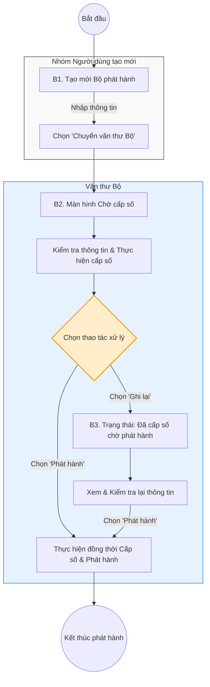

# Quy trình Bộ phát hành

## 1. Biểu đồ luồng nghiệp vụ (Flowchart)

Biểu đồ luồng dưới đây mô tả quá trình tạo mới văn bản từ phía người dùng và các rẽ nhánh thao tác (Ghi lại/Phát hành) làm thay đổi trạng thái văn bản tại bộ phận Văn thư Bộ.

## 2. Mô tả chi tiết nghiệp vụ (Chi tiết theo Role)

B1. Tạo mới Bộ phát hành:

- Đối tượng thực hiện: Chuyên viên/Lãnh đạo phòng/Lãnh đạo trung tâm/Lãnh đạo đơn vị, Thư ký Lãnh đạo Bộ/Lãnh đạo Bộ/Thư ký tổng hợp/Lãnh đạo Văn phòng Bộ.
- Mô tả: Người dùng chọn chức năng Tạo mới – Văn bản đi Bộ phát hành. Tiến hành nhập thông tin tạo mới cho văn bản và chọn nút "Chuyển văn thư Bộ".

B2. Màn hình Chờ cấp số:

- Đối tượng thực hiện: Văn thư Bộ.
- Mô tả: Văn thư Bộ tiếp nhận, thực hiện kiểm tra thông tin văn bản và thực hiện cấp số. Tại bước này hệ thống cho phép 2 nhánh thao tác:
- Nếu người dùng chọn "Ghi lại": Hệ thống thực hiện cấp số và chuyển trạng thái văn bản sang Đã cấp số chờ phát hành (chuyển tiếp sang B3).
- Nếu người dùng chọn "Phát hành": Hệ thống thực hiện đồng thời việc Cấp số và Phát hành văn bản đi ngay lập tức (kết thúc luồng).

B3. Đã cấp số chờ phát hành:

- Đối tượng thực hiện: Văn thư Bộ.
- Mô tả: Văn thư Bộ xem danh sách văn bản đang ở trạng thái Đã cấp số chờ phát hành. Thực hiện kiểm tra lại thông tin và chọn nút "Phát hành" để chính thức phát hành văn bản đi trên hệ thống.