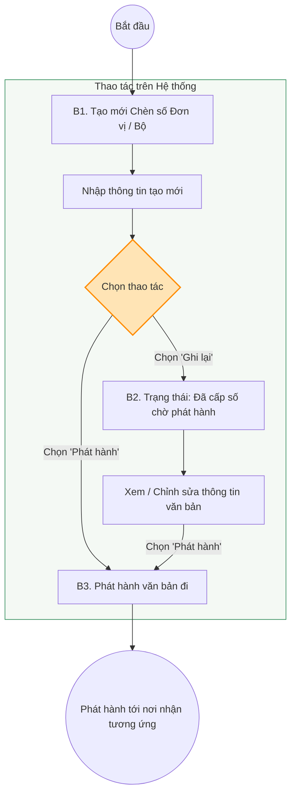

# Quy trình Chèn số (Đơn vị / Bộ phát hành)

## 1. Biểu đồ luồng nghiệp vụ (Flowchart)

Biểu đồ luồng dưới đây mô tả quá trình tạo mới văn bản chèn số và các thao tác dẫn đến thay đổi trạng thái văn bản. Luồng này áp dụng chung cho cả cấp Đơn vị (Văn thư đơn vị) và cấp Bộ (Văn thư Bộ).

## 2. Mô tả chi tiết nghiệp vụ (Chi tiết theo Role)

Lưu ý: Đối tượng sử dụng phụ thuộc vào cấp chèn số. Nếu là "Chèn số đơn vị" thì do Văn thư đơn vị thực hiện. Nếu là "Chèn số Bộ" thì do Văn thư Bộ thực hiện.

B1. Tạo mới Chèn số:

- Mô tả: Văn thư chọn chức năng Chèn số (Đơn vị hoặc Bộ), sau đó tiến hành nhập các thông tin tạo mới theo yêu cầu của hệ thống.
- Nhánh rẽ điều kiện: - Nếu Văn thư chọn nút "Ghi lại": Hệ thống lưu lại và chuyển văn bản sang Bước 2 (B2).
- Nếu Văn thư chọn nút "Phát hành": Hệ thống bỏ qua B2, trực tiếp thực hiện phát hành văn bản đi (chuyển sang Bước 3).

B2. Màn hình trạng thái Đã cấp số chờ phát hành:

- Mô tả: Hệ thống hiển thị trạng thái văn bản là "Đã cấp số chờ phát hành". Tại đây, Văn thư có thể xem và chỉnh sửa thông tin văn bản.
- Sau khi kiểm tra/chỉnh sửa xong, Văn thư chọn nút "Phát hành" để tiến hành phát hành văn bản.

B3. Phát hành văn bản đi:

- Mô tả: Văn bản đi được hệ thống xử lý và phát hành chính thức tới các cơ quan, đơn vị, nơi nhận tương ứng đã được cấu hình từ trước.