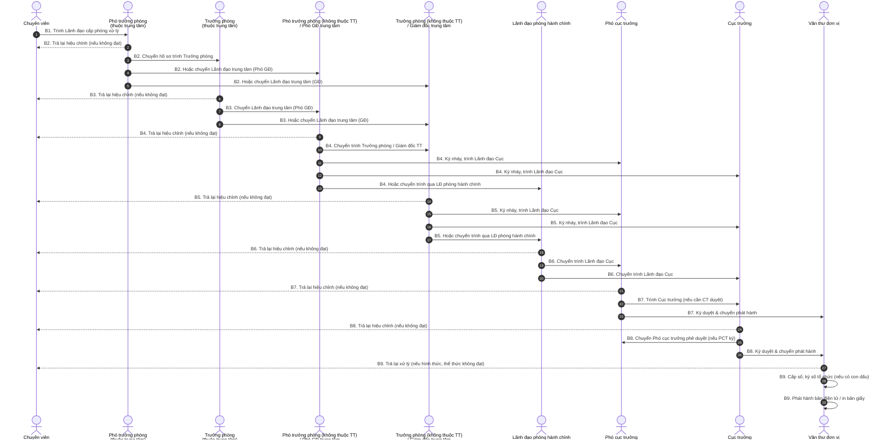

# Luồng quy trình Đơn vị phát hành (Tại Cục)

## 1. Biểu đồ luồng nghiệp vụ (Sequence Diagram)

Biểu đồ tuần tự dưới đây thể hiện chi tiết trách nhiệm, luồng trình duyệt và trả lại (nếu không đạt) giữa các vai trò tham gia trong quy trình phát hành văn bản đi tại Cục.

## 2. Mô tả chi tiết nghiệp vụ (Chi tiết theo Role)

B1. Chuyên viên:

- Soạn thảo dự thảo, đính kèm văn bản liên quan, chịu trách nhiệm về hình thức/thể thức.
- Tạo lập hồ sơ điện tử trình Lãnh đạo cấp phòng xử lý (Trưởng phòng hoặc Phó Trưởng phòng).

B2. Phó trưởng phòng (thuộc trung tâm):

- Tiếp nhận rà soát.
- Trả lại Chuyên viên nếu không đạt.
- Nếu đạt, chuyển hồ sơ lên Trưởng phòng hoặc Lãnh đạo trung tâm (Phó giám đốc hoặc Giám đốc trung tâm).

B3. Trưởng phòng (thuộc trung tâm):

- Tiếp nhận rà soát.
- Trả lại Chuyên viên nếu không đạt.
- Nếu đạt, chuyển hồ sơ lên Lãnh đạo trung tâm (Phó giám đốc hoặc Giám đốc trung tâm).

B4. Phó trưởng phòng (không thuộc trung tâm)/Phó giám đốc trung tâm:

- Tiếp nhận hồ sơ.
- Trả lại Chuyên viên nếu không đạt.
- Nếu cần trình cao hơn, chuyển Trưởng phòng/Giám đốc trung tâm.
- Nếu đạt và cần chuyển Lãnh đạo Cục, thực hiện ký nháy và trình Lãnh đạo Cục (Cục trưởng hoặc Phó cục trưởng) hoặc chuyển Lãnh đạo phòng hành chính để trình.

B5. Trưởng phòng (không thuộc trung tâm)/Giám đốc trung tâm:

- Rà soát nội dung.
- Trả lại Chuyên viên nếu không đạt.
- Nếu đạt, thực hiện ký nháy và trình tới Lãnh đạo Cục (Cục trưởng hoặc Phó cục trưởng) hoặc chuyển Lãnh đạo phòng hành chính để trình.

B6. Lãnh đạo phòng hành chính:

- Tiếp nhận dự thảo điện tử, rà soát.
- Trả lại Chuyên viên nếu không đạt.
- Nếu đạt, chuyển trình hồ sơ đến Lãnh đạo Cục (Cục trưởng hoặc Phó cục trưởng).

B7. Phó cục trưởng:

- Rà soát nội dung.
- Trả lại Chuyên viên nếu không đạt.
- Nếu Phó cục trưởng ký duyệt, thực hiện ký và chuyển Văn thư đơn vị.
- Nếu cần Cục trưởng duyệt, trình lên Cục trưởng.

B8. Cục trưởng:

- Rà soát nội dung.
- Trả lại Chuyên viên nếu không đạt.
- Nếu Cục trưởng ký duyệt, thực hiện ký và chuyển Văn thư đơn vị.
- Nếu Phó cục trưởng là người ký, chuyển dự thảo cho Phó cục trưởng phê duyệt.

B9. Văn thư đơn vị:

- Tiếp nhận văn bản có chữ ký số của Lãnh đạo.
- Kiểm tra hình thức, thể thức.
- Trả lại cán bộ soạn thảo nếu không đạt.
- Nếu đạt, thực hiện cấp số, ký số tổ chức (đối với đơn vị có con dấu) và phát hành bản điện tử/bản giấy.
- Xử lý lưu trữ theo nghiệp vụ đơn vị có/không có con dấu.