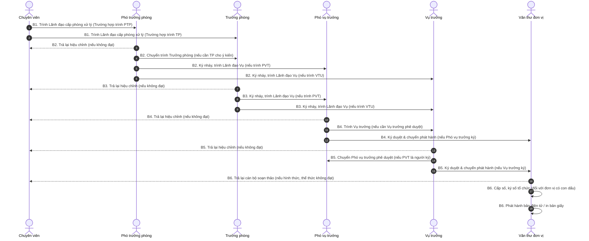

# Quy trình Đơn vị phát hành (Tại Vụ có phòng)

## 1. Biểu đồ luồng nghiệp vụ (Sequence Diagram)

Biểu đồ tuần tự dưới đây thể hiện trách nhiệm các cấp lãnh đạo trong việc xử lý, ký nháy, ký duyệt và phát hành văn bản tại Vụ có phòng, bám sát các luồng điều kiện thực tế.

## 2. Mô tả chi tiết nghiệp vụ (Chi tiết theo Role)

B1. Chuyên viên: Soạn thảo dự thảo, đính kèm các văn bản liên quan.

- Chịu trách nhiệm về hình thức, thể thức và nhập đầy đủ thông tin văn bản điện tử.
- Tạo lập hồ sơ và chuyển Lãnh đạo cấp phòng xử lý (Trưởng phòng hoặc Phó trưởng phòng).

B2. Phó trưởng phòng: Tiếp nhận hồ sơ rà soát.

- Trả lại chuyên viên để hiệu chỉnh nếu không đạt.
- Chuyển trình Trưởng phòng nếu cần Trưởng phòng cho ý kiến.
- Thực hiện ký nháy dự thảo và trình hồ sơ tới Lãnh đạo Vụ (Vụ trưởng hoặc Phó vụ trưởng) nếu đã đạt yêu cầu.

B3. Trưởng phòng: Tiếp nhận dự thảo rà soát.

- Trả lại chuyên viên để hiệu chỉnh nếu không đạt.
- Thực hiện ký nháy dự thảo và trình tới Lãnh đạo Vụ (Vụ trưởng hoặc Phó vụ trưởng) nếu đã đạt yêu cầu.

B4. Phó vụ trưởng: Rà soát nội dung.

- Trả lại chuyên viên để hiệu chỉnh nếu không đạt.
- Nếu Phó vụ trưởng là người ký duyệt: Ký duyệt văn bản đi và chuyển Văn thư đơn vị phát hành.
- Nếu cần Vụ trưởng phê duyệt: Chuyển dự thảo lên Vụ trưởng.

B5. Vụ trưởng: Rà soát nội dung.

- Trả lại chuyên viên để hiệu chỉnh nếu không đạt.
- Nếu Vụ trưởng là người ký duyệt: Ký duyệt văn bản đi và chuyển Văn thư đơn vị phát hành.
- Nếu Phó vụ trưởng là người ký duyệt: Chuyển dự thảo văn bản đi cho Phó vụ trưởng phê duyệt.

B6. Văn thư đơn vị: Tiếp nhận văn bản đã được Lãnh đạo ký số, kiểm tra thể thức.

- Trả lại cán bộ soạn thảo để xử lý nếu không đạt.
- Nếu đạt, thực hiện cấp số, ký số tổ chức (đối với đơn vị có con dấu). Phát hành bản điện tử đến các đơn vị đủ điều kiện và phát hành bản giấy đối với các đơn vị chưa đủ điều kiện nhận văn bản điện tử. Thực hiện lưu trữ theo quy định.