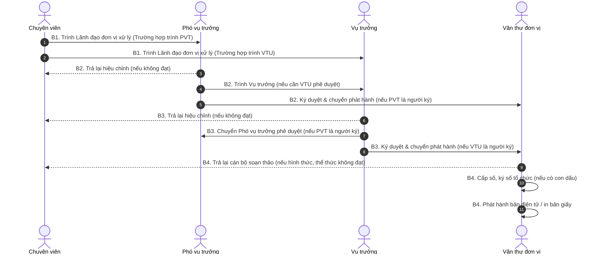

# Quy trình Đơn vị phát hành (Tại Vụ không có phòng)

## 1. Biểu đồ luồng nghiệp vụ (Sequence Diagram)

Biểu đồ tuần tự dưới đây thể hiện sự tương tác nhanh gọn do mô hình Vụ không có phòng (bỏ qua cấp phòng, chuyên viên trình trực tiếp lên Lãnh đạo Vụ).

## 2. Mô tả chi tiết nghiệp vụ (Chi tiết theo Role)

B1. Chuyên viên:

- Soạn thảo dự thảo, đính kèm các văn bản liên quan.
- Chịu trách nhiệm về hình thức, thể thức văn bản và nhập đầy đủ thông tin văn bản điện tử.
- Tạo lập hồ sơ điện tử chuyển trực tiếp cho Lãnh đạo đơn vị xử lý (Vụ trưởng hoặc Phó vụ trưởng).

B2. Phó vụ trưởng:

- Tiếp nhận dự thảo điện tử và rà soát nội dung.
- Trả lại chuyên viên để hiệu chỉnh nếu không đạt.
- Nếu Phó vụ trưởng là người ký duyệt: Ký duyệt văn bản đi và chuyển Văn thư đơn vị phát hành.
- Nếu cần Vụ trưởng phê duyệt: Chuyển dự thảo văn bản đi lên Vụ trưởng.

B3. Vụ trưởng:

- Tiếp nhận dự thảo văn bản đi và rà soát nội dung.
- Trả lại chuyên viên để hiệu chỉnh nếu không đạt.
- Nếu Vụ trưởng là người ký duyệt: Ký duyệt văn bản đi và chuyển Văn thư đơn vị phát hành.
- Nếu Phó vụ trưởng là người ký duyệt: Chuyển dự thảo văn bản đi cho Phó vụ trưởng phê duyệt.

B4. Văn thư đơn vị:

- Tiếp nhận văn bản đã được Lãnh đạo đơn vị ký số, kiểm tra lại hình thức, thể thức văn bản.
- Trả lại cán bộ soạn thảo để xử lý nếu không đạt yêu cầu.
- Nếu đạt, thực hiện cấp số, ký số tổ chức (đối với đơn vị có con dấu).
- Phát hành bản điện tử đến các cơ quan, tổ chức đủ điều kiện và phát hành bản giấy đối với các cơ quan chưa đủ điều kiện nhận văn bản điện tử.
- Thực hiện công tác lưu trữ (chuyển bản chính giấy hoặc lưu văn bản điện tử) theo quy định của đơn vị có/không có con dấu.