# Thiết kế Database Phân quyền mới theo mô hình Hierarchical Multi-Tenant (Materialized Path)

**Ngày cập nhật:** 05/05/2026  
**Mục tiêu:** Thiết kế lại database phân quyền theo mô hình multi-tenant phân cấp cha-con, vẫn giữ lõi phân quyền hiện tại của hệ thống.

---

# 1. Bài toán nghiệp vụ cần giải quyết

Hệ thống mới phải giải quyết đồng thời 3 lớp phân quyền:

1. **Phân quyền chức năng**: user được làm gì, ví dụ xem, tạo, sửa, duyệt, xóa, cấu hình.
2. **Phân quyền phạm vi dữ liệu**: user được nhìn dữ liệu thuộc tenant nào.
3. **Phân quyền API endpoint**: endpoint nào yêu cầu action nào hoặc role nào.

Ba lớp này liên quan với nhau nhưng không được trộn lẫn trong thiết kế database.

---

## 1.1. Bối cảnh tổ chức

Tổ chức vận hành theo mô hình phân cấp:

```text
Bộ
└── Cục / Vụ / Tổng cục / Ủy ban
    └── Trung tâm / Phòng / Tổ / Chi cục
```

Mỗi đơn vị là một **tenant độc lập**, nhưng tenant có quan hệ cha-con.

Ví dụ:

```text
Bộ Y Tế                    TenantId = 1     Path = /1/
Cục Y Tế Dự Phòng          TenantId = 15    Path = /1/15/
Trung tâm tiêm chủng       TenantId = 300   Path = /1/15/300/
```

---

## 1.2. Quy tắc nghiệp vụ dữ liệu

### Quy tắc 1 — Tenant cha xem được dữ liệu tenant con

- Bộ xem được dữ liệu của toàn bộ Cục/Vụ/Tổng cục/Trung tâm bên dưới.
- Cục xem được dữ liệu của chính Cục và các Trung tâm trực thuộc.

### Quy tắc 2 — Tenant con không xem được dữ liệu tenant cha

- Trung tâm không xem được dữ liệu của Cục.
- Cục không xem được dữ liệu của Bộ hoặc các cấp cao hơn.

### Quy tắc 3 — Tenant ngang cấp không xem chéo nhau

- Cục A không xem được Cục B.
- Trung tâm A1 không xem được Trung tâm B1.

### Quy tắc 4 — Mỗi bản ghi nghiệp vụ luôn thuộc một tenant sở hữu trực tiếp

Business table chỉ cần lưu `TenantId`. Khi đọc dữ liệu theo cây, join sang `Tenants` để lọc bằng `Path`.

---

## 1.3. Quy tắc nghiệp vụ chức năng

User phải có action phù hợp mới được thao tác.

Ví dụ:

- `document.view`: xem hồ sơ/văn bản
- `document.create`: tạo hồ sơ/văn bản
- `document.update`: sửa hồ sơ/văn bản
- `document.approve`: phê duyệt
- `tenant.manage`: quản trị tenant
- `user.assign-role`: gán quyền cho user

---

## 1.4. Quy tắc phân quyền API

Code hiện tại cho thấy API authorization đi theo luồng:

```text
API Endpoint -> Api / ApiAction -> ActionCode
User Role -> Role -> Action
So sánh ActionCode của API với ActionCode user đang có
```

Theo [ApiActionAuthorizeAttribute.cs](source/System.OneWin.Security/Attributes/ApiActionAuthorizeAttribute.cs#L20-L25), flow thực tế là:

1. Lấy ActionCode được gán cho API endpoint từ database.
2. Lấy ActionCode của user/role.
3. Nếu có match thì cho truy cập.

Ngoài ra, code còn hỗ trợ permission hierarchy theo ActionCode dạng dotted notation:

- nếu user có `task.incoming`
- thì được coi như có `task.incoming.pending.pendingKey`

Xem [ApiActionAuthorizeAttribute.cs:245-274](source/System.OneWin.Security/Attributes/ApiActionAuthorizeAttribute.cs#L245-L274).

Codebase còn có `IRoleOfApiService`, `RoleOfApiService` và `RoleOfApiAuthorizeAttribute`, nên thiết kế DB cần giữ phần `RoleOfApi` để tương thích luồng hiện tại.

---

## 1.5. Kết luận nghiệp vụ

Hệ thống mới cần mô hình sau:

- **Hierarchical tenant isolation** bằng `TenantId + ParentTenantId + Path`
- **RBAC** bằng `Role + Action + RoleOfStaffs`
- **Global identity** bằng `Staffs` không gắn cứng vào tenant
- **Tenant assignment** bằng `RoleOfStaffs.TenantId`
- **Override cá nhân theo tenant** bằng `StaffActions`
- **API authorization mapping** bằng `Apis`, `ApiActions`, `RoleOfApis`

Kết luận:

> User chỉ được thao tác trên dữ liệu nếu đồng thời có **action phù hợp**, endpoint đang gọi map tới action đó, và action đó có hiệu lực tại **tenant đang thao tác**; khi đọc dữ liệu thì chỉ nhìn thấy các tenant nằm trong phạm vi `Path` được phép truy cập.

---

# 2. Nguyên tắc thiết kế kiến trúc

## 2.1. Tách bạch 3 lớp

### Permission layer

Trả lời câu hỏi:

> User có action gì?

### Data visibility layer

Trả lời câu hỏi:

> User có nhìn thấy dữ liệu của tenant này không?

### API authorization layer

Trả lời câu hỏi:

> Endpoint này yêu cầu action nào hoặc role nào?

---

## 2.2. Dùng Materialized Path

Tenant dùng `Path` để lưu đường dẫn phân cấp:

```text
/1/
/1/15/
/1/15/300/
```

`Path` phục vụ query subtree bằng prefix search:

```sql
WHERE Tenants.Path LIKE @CurrentTenantPath + '%'
```

`ParentTenantId` vẫn được duy trì để RDBMS bảo vệ quan hệ cha-con, đặc biệt ngăn xóa nhầm node cha khi còn node con.

---

# 3. Rà soát bảng: giữ, bổ sung, loại bỏ

## 3.1. Bảng giữ trong thiết kế core

| Bảng | Kết luận | Lý do |
|---|---|---|
| `Tenants` | Giữ | Bảng lõi cho multi-tenant phân cấp |
| `Staffs` | Giữ | Danh tính user/cán bộ toàn cục, không gắn cứng tenant |
| `Departments` | Giữ | Phòng ban nội bộ trong tenant |
| `Positions` | Giữ | Chức vụ dùng lại toàn hệ thống |
| `Roles` | Giữ | Gói quyền theo tenant |
| `Actions` | Giữ | Permission atom |
| `ActionRoles` | Giữ | Mapping role-action, lõi RBAC |
| `RoleOfStaffs` | Giữ | Gán role cho user tại một tenant cụ thể |
| `StaffActions` | Giữ | Override quyền cá nhân theo tenant |
| `GroupActions` | Giữ | Template gom nhóm action |
| `GroupActionDetails` | Giữ | Chi tiết action trong template |
| `GroupRoles` | Giữ | Gán template group vào role |
| `Apis` | Giữ | Endpoint registry/master |
| `ApiActions` | Giữ | Mapping endpoint -> action |
| `RoleOfApis` | Giữ | Compatibility mapping endpoint -> role |

---


# 4. Thiết kế chi tiết từng bảng

## 4.1. `Tenants`

### Vai trò

Bảng lõi của mô hình hierarchical multi-tenant.

### Nhiệm vụ

- Quản lý cây tổ chức cha-con.
- Xác định tenant cha trực tiếp qua `ParentTenantId`.
- Xác định toàn bộ lineage qua `Path`.
- Là điểm join để lọc dữ liệu theo phạm vi nhìn xuống.

### Cột chính

- `TenantId`: khóa chính, dùng làm FK ở các bảng khác.
- `ParentTenantId`: tenant cha trực tiếp.
- `Path`: materialized path, ví dụ `/1/15/300/`.
- `Level`: cấp độ trong cây.
- `TenantType`: loại tenant, ví dụ Bộ/Cục/Trung tâm.
- `Code`, `Name`: mã và tên nghiệp vụ.
- `IsActive`, `IsDeleted`: trạng thái.

---

## 4.2. `Staffs`

### Vai trò

Danh tính user/cán bộ toàn cục.

### Nhiệm vụ

- Lưu thông tin đăng nhập và định danh user.
- Không gắn cứng vào tenant nào.
- Tenant membership được xác định qua `RoleOfStaffs`.

### Cột chính

- `StaffId`
- `UserName`
- `FullName`
- `Email`
- `DepartmentId` (nullable)
- `PositionId` (nullable)
- `IsSystemAdmin`
- `IsLocked`

### Ghi chú

Staff là global identity. Một staff có thể được gán role tại nhiều tenant khác nhau thông qua bảng `RoleOfStaffs`.

---

## 4.3. `Departments`

### Vai trò

Phòng/ban nội bộ trong một tenant.

### Nhiệm vụ

- Tổ chức nhân sự trong tenant.
- Hỗ trợ scope role theo phòng ban nếu nghiệp vụ cần.

### Cột chính

- `DepartmentId`
- `TenantId`
- `Code`
- `Name`

---

## 4.4. `Positions`

### Vai trò

Danh mục chức vụ.

### Nhiệm vụ

- Hỗ trợ phân loại nhân sự theo chức vụ.
- Hỗ trợ rule nghiệp vụ liên quan tới lãnh đạo/chuyên viên/trưởng phòng.

### Cột chính

- `PositionId`
- `Code`
- `Name`

---

## 4.5. `Actions`

### Vai trò

Permission atom nhỏ nhất trong hệ thống.

### Nhiệm vụ

- Định nghĩa action dùng để authorize.
- Là đơn vị được gán cho role, tenant và override cho staff.
- Là action code mà API endpoint sẽ map tới.

### Cột chính

- `ActionId`
- `Code`: ví dụ `document.view`, `task.incoming.pending`
- `Name`
- `Description`
- `IsActive`, `IsDeleted`

### Ghi chú

Action code trong hệ thống hiện tại mang tính phân cấp theo dấu `.`. Ví dụ `task.incoming` bao phủ `task.incoming.pending.pendingKey` theo logic authorize hiện tại.

---

## 4.6. `Roles`

### Vai trò

Gói quyền theo tenant.

### Nhiệm vụ

- Gom nhiều action thành một vai trò nghiệp vụ.
- Scoped theo tenant qua `TenantId`.
- Dùng để gán cho staff.

### Cột chính

- `RoleId`
- `TenantId`
- `Code`
- `Name`
- `Description`
- `IsDefault`
- `IsLocked`

---

## 4.7. `ActionRoles`

### Vai trò

Mapping N-N giữa role và action.

### Nhiệm vụ

- Xác định role có những action nào.
- Là trung tâm của RBAC.

### Cột chính

- `RoleId`
- `ActionId`

---

## 4.8. `RoleOfStaffs`

### Vai trò

Gán role cho user tại một tenant cụ thể.

### Nhiệm vụ

- Xác định staff có role nào.
- Xác định role đó hiệu lực tại tenant nào qua `TenantId`.
- Cho phép user làm việc tại nhiều tenant khác nhau.

### Cột chính

- `RoleOfStaffId`
- `StaffId`
- `RoleId`
- `TenantId` — tenant mà role này có hiệu lực
- `DepartmentId` (nullable)
- `PositionId` (nullable)
- `IsDefault`
- `IsActive`

### Mô hình global staff

Vì `Staffs` không có `TenantId`, toàn bộ tenant membership của một staff được xác định thông qua các dòng trong `RoleOfStaffs.TenantId`. Một staff có thể xuất hiện ở nhiều tenant, mỗi tenant ứng với một hoặc nhiều dòng `RoleOfStaffs`.

---

## 4.9. `StaffActions`

### Vai trò

Override quyền ở cấp cá nhân, scoped theo tenant.

### Nhiệm vụ

- Cấp thêm quyền riêng cho staff tại một tenant cụ thể.
- Thu hồi quyền của staff tại một tenant dù role đang có.
- Xử lý ngoại lệ nghiệp vụ.

### Cột chính

- `StaffActionId`
- `StaffId`
- `TenantId` — tenant mà override này áp dụng
- `ActionId`
- `RoleId` (nullable)
- `OverrideType`: `1=Grant`, `2=Revoke`
- `Note`

---

## 4.10. `GroupActions`

### Vai trò

Template nhóm action.

### Nhiệm vụ

- Gom nhiều action thành template.
- Giúp admin gán quyền nhanh.
- Chuẩn hóa các bộ quyền thường dùng.

### Cột chính

- `GroupActionId`
- `Code`
- `Name`
- `Description`

---

## 4.11. `GroupActionDetails`

### Vai trò

Chi tiết action trong một group/template.

### Nhiệm vụ

- Xác định group action gồm những action nào.
- Phục vụ UI chọn nhanh nhóm quyền.

### Cột chính

- `GroupActionId`
- `ActionId`

---

## 4.12. `GroupRoles`

### Vai trò

Mapping group action vào role.

### Nhiệm vụ

- Cho phép role nhận trọn bộ action từ template.
- Hỗ trợ UI gán quyền nhanh.

### Lưu ý kiến trúc

Nên chọn cách **materialize**: khi gán `GroupRoles`, backend sinh các dòng tương ứng vào `ActionRoles`. Khi check quyền runtime chỉ đọc `ActionRoles`.

---

## 4.13. `Apis` — bảng bổ sung bắt buộc

### Vai trò

Master table của các API endpoint hoặc logical endpoint trong hệ thống.

### Nhiệm vụ

- Quản lý metadata của endpoint.
- Định danh endpoint theo `ServiceGroup`, `Controller`, `Action`, `Method`.
- Là cầu nối giữa endpoint thực tế và quyền action trong DB.

### Vì sao cần bảng này

Theo [ApiActionAuthorizeAttribute.cs](source/System.OneWin.Security/Attributes/ApiActionAuthorizeAttribute.cs#L20-L25), hệ thống hiện tại đang lấy action code của API từ DB theo endpoint. Ngoài ra comment trong code còn nói rõ các bảng liên quan là `Api`, `ApiAction`, `Action2`.

### Cột chính đề xuất

- `ApiId`
- `ServiceGroup`: ví dụ `ApiService`
- `ControllerCode`: ví dụ `IncomingController`
- `ActionCode`: ví dụ `GetByFilter`
- `HttpMethod`: `GET`, `POST`, `PUT`, `DELETE`
- `EndpointPattern`: route pattern nếu cần lưu rõ
- `IsActive`
- `IsDeleted`

---

## 4.14. `ApiActions` — bảng bổ sung bắt buộc

### Vai trò

Mapping giữa API endpoint và action nghiệp vụ.

### Nhiệm vụ

- Xác định endpoint nào yêu cầu action nào.
- Cho phép 1 endpoint map tới nhiều action code nếu cần.
- Là input trực tiếp cho `ApiActionAuthorizeAttribute`.

### Dấu vết từ code

`ApiActionModel` cho thấy rõ mô hình gồm:

- `ActionId`
- `ApiId`
- `ControllerName`
- `ApiActionName`
- `Endpoint`
- `ActionCode`

Xem [ApiActionModel.cs:9-50](source/OneWin.Data.Object/Models/ApiActionModel.cs#L9-L50).

### Cột chính đề xuất

- `ApiActionId`
- `ApiId`
- `ActionId`
- `IsRequired`: nếu sau này muốn mở rộng AND/OR semantics
- `CreatedDate`

---

## 4.15. `RoleOfApis` — bảng bổ sung bắt buộc

### Vai trò

Mapping trực tiếp giữa endpoint và role code nếu vẫn muốn giữ compatibility với luồng authorize hiện tại theo role endpoint.

### Nhiệm vụ

- Xác định endpoint nào cho role nào truy cập.
- Phục vụ `RoleOfApiAuthorizeAttribute` hiện có.
- Hỗ trợ giai đoạn chuyển tiếp nếu hệ thống đang dùng song song 2 kiểu authorize:
  - authorize theo `ActionCode`
  - authorize theo `RoleId`

### Dấu vết từ code

Có `IRoleOfApiService`, `RoleOfApiService` và `RoleOfApiAuthorizeAttribute` trong codebase. Điều này cho thấy luồng role-of-api đang tồn tại thực tế, không nên bỏ khỏi thiết kế nếu cần backward compatibility.

### Cột chính

- `RoleOfApiId`
- `ApiId`
- `RoleId`
- `IsActive`
- `CreatedDate`

### Ghi chú kiến trúc

Nếu tương lai hệ thống chuẩn hóa hoàn toàn về `Api -> Action -> Role`, bảng này có thể bị loại bỏ. Nhưng ở thời điểm hiện tại, nó nên được giữ vì code đang dùng.

---

# 5. Bảng dữ liệu nghiệp vụ

Mỗi bảng nghiệp vụ thật như `Documents`, `Dossiers`, `Submissions`, `Notifications` cần có:

- `TenantId`
- `CreatedDate`
- `CreatedBy`
- `ModifiedDate`
- `ModifiedBy`
- `IsDeleted`
- `DeletedBy`
- `DeletedAt`

Không tạo bảng generic `BusinessData` thật.

Ví dụ:

```sql
Documents(
    DocumentId,
    TenantId,
    Title,
    Status,
    CreatedDate,
    CreatedBy,
    ModifiedDate,
    ModifiedBy,
    IsDeleted,
    DeletedBy,
    DeletedAt
)
```

Query đọc theo phạm vi tenant:

```sql
SELECT d.*
FROM Documents d
JOIN Tenants t ON t.TenantId = d.TenantId
WHERE t.Path LIKE @CurrentTenantPath + '%'
  AND d.IsDeleted = 0
  AND t.IsDeleted = 0;
```

---

# 6. Sơ đồ quan hệ tổng quát

```mermaid
erDiagram
    TENANT ||--o{ TENANT : "parent-child"
    TENANT ||--o{ DEPARTMENT : "has departments"
    TENANT ||--o{ ROLE : "owns/scoped"
    TENANT ||--o{ ROLE_OF_STAFF : "working context"
    TENANT ||--o{ STAFF_ACTION : "override scope"
    TENANT ||--o{ BUSINESS_DATA : "owns data"

    POSITION ||--o{ STAFF : "assigned position"
    DEPARTMENT ||--o{ STAFF : "works in"

    STAFF ||--o{ ROLE_OF_STAFF : "has roles"
    STAFF ||--o{ STAFF_ACTION : "overrides"

    ROLE ||--o{ ROLE_OF_STAFF : "assigned to"
    ROLE ||--o{ ACTION_ROLE : "grants"
    ROLE ||--o{ STAFF_ACTION : "context"
    ROLE ||--o{ GROUP_ROLE : "receives group"

    ACTION ||--o{ ACTION_ROLE : "granted"
    ACTION ||--o{ STAFF_ACTION : "overridden"
    ACTION ||--o{ GROUP_ACTION_DETAIL : "in group"
    ACTION ||--o{ API_ACTION : "required by endpoint"

    GROUP_ACTION ||--o{ GROUP_ACTION_DETAIL : "contains"
    GROUP_ACTION ||--o{ GROUP_ROLE : "assigned to role"

    API ||--o{ API_ACTION : "maps to actions"
    API ||--o{ ROLE_OF_API : "maps to roles"

    TENANT {
        uniqueidentifier TenantId PK
        uniqueidentifier ParentTenantId FK
        nvarchar50 Code
        nvarchar255 Name
        tinyint TenantType
        varchar900 Path "Materialized Path: /1/15/300/"
        int Level
        bit IsActive
        datetime2 CreatedDate
        uniqueidentifier CreatedBy
        datetime2 ModifiedDate
        uniqueidentifier ModifiedBy
        bit IsDeleted
        uniqueidentifier DeletedBy
        datetime2 DeletedAt
    }

    STAFF {
        uniqueidentifier StaffId PK
        nvarchar100 UserName
        nvarchar255 FullName
        nvarchar255 Email
        uniqueidentifier DepartmentId FK
        uniqueidentifier PositionId FK
        bit IsSystemAdmin
        bit IsLocked
        datetime2 CreatedDate
        uniqueidentifier CreatedBy
        datetime2 ModifiedDate
        uniqueidentifier ModifiedBy
        bit IsDeleted
        uniqueidentifier DeletedBy
        datetime2 DeletedAt
    }

    DEPARTMENT {
        uniqueidentifier DepartmentId PK
        uniqueidentifier TenantId FK
        nvarchar50 Code
        nvarchar255 Name
        datetime2 CreatedDate
        uniqueidentifier CreatedBy
        datetime2 ModifiedDate
        uniqueidentifier ModifiedBy
        bit IsDeleted
        uniqueidentifier DeletedBy
        datetime2 DeletedAt
    }

    POSITION {
        uniqueidentifier PositionId PK
        nvarchar50 Code
        nvarchar255 Name
        datetime2 CreatedDate
        uniqueidentifier CreatedBy
        datetime2 ModifiedDate
        uniqueidentifier ModifiedBy
        bit IsDeleted
        uniqueidentifier DeletedBy
        datetime2 DeletedAt
    }

    ROLE {
        uniqueidentifier RoleId PK
        uniqueidentifier TenantId FK
        nvarchar100 Code
        nvarchar255 Name
        bit IsDefault
        bit IsLocked
        datetime2 CreatedDate
        uniqueidentifier CreatedBy
        datetime2 ModifiedDate
        uniqueidentifier ModifiedBy
        bit IsDeleted
        uniqueidentifier DeletedBy
        datetime2 DeletedAt
    }

    ACTION {
        uniqueidentifier ActionId PK
        nvarchar150 Code "used in authorize"
        nvarchar255 Name
        bit IsActive
        datetime2 CreatedDate
        uniqueidentifier CreatedBy
        datetime2 ModifiedDate
        uniqueidentifier ModifiedBy
        bit IsDeleted
        uniqueidentifier DeletedBy
        datetime2 DeletedAt
    }

    ROLE_OF_STAFF {
        uniqueidentifier RoleOfStaffId PK
        uniqueidentifier StaffId FK
        uniqueidentifier RoleId FK
        uniqueidentifier TenantId FK "tenant where role is active"
        uniqueidentifier DepartmentId FK
        uniqueidentifier PositionId FK
        bit IsDefault
        bit IsActive
        datetime2 CreatedDate
        uniqueidentifier CreatedBy
        datetime2 ModifiedDate
        uniqueidentifier ModifiedBy
        bit IsDeleted
        uniqueidentifier DeletedBy
        datetime2 DeletedAt
    }

    ACTION_ROLE {
        uniqueidentifier RoleId FK
        uniqueidentifier ActionId FK
        datetime2 CreatedDate
        uniqueidentifier CreatedBy
        bit IsDeleted
        uniqueidentifier DeletedBy
        datetime2 DeletedAt
    }

    STAFF_ACTION {
        uniqueidentifier StaffActionId PK
        uniqueidentifier StaffId FK
        uniqueidentifier TenantId FK "tenant where override applies"
        uniqueidentifier ActionId FK
        uniqueidentifier RoleId FK
        tinyint OverrideType "1=Grant, 2=Revoke"
        datetime2 CreatedDate
        uniqueidentifier CreatedBy
        datetime2 ModifiedDate
        uniqueidentifier ModifiedBy
        bit IsDeleted
        uniqueidentifier DeletedBy
        datetime2 DeletedAt
    }

    GROUP_ACTION {
        uniqueidentifier GroupActionId PK
        nvarchar100 Code
        nvarchar255 Name
        datetime2 CreatedDate
        uniqueidentifier CreatedBy
        datetime2 ModifiedDate
        uniqueidentifier ModifiedBy
        bit IsDeleted
        uniqueidentifier DeletedBy
        datetime2 DeletedAt
    }

    GROUP_ACTION_DETAIL {
        uniqueidentifier GroupActionId FK
        uniqueidentifier ActionId FK
        datetime2 CreatedDate
        uniqueidentifier CreatedBy
        bit IsDeleted
        uniqueidentifier DeletedBy
        datetime2 DeletedAt
    }

    GROUP_ROLE {
        uniqueidentifier GroupActionId FK
        uniqueidentifier RoleId FK
        datetime2 CreatedDate
        uniqueidentifier CreatedBy
        bit IsDeleted
        uniqueidentifier DeletedBy
        datetime2 DeletedAt
    }

    API {
        uniqueidentifier ApiId PK
        nvarchar50 ServiceGroup
        nvarchar150 ControllerCode
        nvarchar150 ActionCode
        nvarchar10 HttpMethod
        nvarchar500 EndpointPattern
        bit IsActive
        datetime2 CreatedDate
        uniqueidentifier CreatedBy
        datetime2 ModifiedDate
        uniqueidentifier ModifiedBy
        bit IsDeleted
        uniqueidentifier DeletedBy
        datetime2 DeletedAt
    }

    API_ACTION {
        uniqueidentifier ApiActionId PK
        uniqueidentifier ApiId FK
        uniqueidentifier ActionId FK
        bit IsRequired
        datetime2 CreatedDate
        uniqueidentifier CreatedBy
        bit IsDeleted
        uniqueidentifier DeletedBy
        datetime2 DeletedAt
    }

    ROLE_OF_API {
        uniqueidentifier RoleOfApiId PK
        uniqueidentifier ApiId FK
        uniqueidentifier RoleId FK
        bit IsActive
        datetime2 CreatedDate
        uniqueidentifier CreatedBy
        bit IsDeleted
        uniqueidentifier DeletedBy
        datetime2 DeletedAt
    }

    BUSINESS_DATA {
        uniqueidentifier Id PK
        uniqueidentifier TenantId FK
        datetime2 CreatedDate
        uniqueidentifier CreatedBy
        datetime2 ModifiedDate
        uniqueidentifier ModifiedBy
        bit IsDeleted
        uniqueidentifier DeletedBy
        datetime2 DeletedAt
    }
```



---

# 7. Thiết kế database theo định dạng dbdiagram.io

```dbml
Project hierarchical_multitenant_permissions {
  database_type: "SQLServer"
  Note: '''
    Production-ready DBML for dbdiagram.io relationship view.
    Full base audit columns are included for DDL readiness.

    Last updated: 2026-05-06
  '''
}

// =====================================================
// 1. CORE ORGANIZATION
// Place this group on the LEFT in dbdiagram.
// =====================================================

Table Tenants [headercolor: #1E88E5] {
  TenantId uniqueidentifier [pk, not null]
  ParentTenantId uniqueidentifier [null]
  Code nvarchar(50) [not null]
  Name nvarchar(255) [not null]
  TenantType tinyint [not null, note: '1=Bo, 2=Cuc/Vu/TongCuc, 3=TrungTam/Phong/...']
  Level int [not null]
  Path varchar(900) [not null, note: 'Materialized Path, vd: /1/15/300/']
  IsActive bit [not null, default: 1]
  CreatedDate datetime2 [not null]
  CreatedBy uniqueidentifier [null]
  ModifiedDate datetime2 [null]
  ModifiedBy uniqueidentifier [null]
  IsDeleted bit [not null, default: 0]
  DeletedBy uniqueidentifier [null]
  DeletedAt datetime2 [null]

  Indexes {
    (Code) [unique, name: 'UX_Tenants_Code_Active']
    (Path) [unique, name: 'UX_Tenants_Path_Active']
    (ParentTenantId) [name: 'IX_Tenants_ParentTenantId']
    (Path) [name: 'IX_Tenants_Path']
  }

  Note: 'Root table for tenant hierarchy and data visibility scope.'
}

Table Departments [headercolor: #1E88E5] {
  DepartmentId uniqueidentifier [pk, not null]
  TenantId uniqueidentifier [not null]
  Code nvarchar(50) [not null]
  Name nvarchar(255) [not null]
  CreatedDate datetime2 [not null]
  CreatedBy uniqueidentifier [null]
  ModifiedDate datetime2 [null]
  ModifiedBy uniqueidentifier [null]
  IsDeleted bit [not null, default: 0]
  DeletedBy uniqueidentifier [null]
  DeletedAt datetime2 [null]

  Indexes {
    (TenantId, Code) [unique, name: 'UX_Departments_TenantId_Code']
    (TenantId) [name: 'IX_Departments_TenantId']
  }

  Note: 'Internal department within a tenant.'
}

Table Positions [headercolor: #1E88E5] {
  PositionId uniqueidentifier [pk, not null]
  Code nvarchar(50) [not null]
  Name nvarchar(255) [not null]
  CreatedDate datetime2 [not null]
  CreatedBy uniqueidentifier [null]
  ModifiedDate datetime2 [null]
  ModifiedBy uniqueidentifier [null]
  IsDeleted bit [not null, default: 0]
  DeletedBy uniqueidentifier [null]
  DeletedAt datetime2 [null]

  Indexes {
    (Code) [unique, name: 'UX_Positions_Code']
  }

  Note: 'Global catalog of staff positions/titles. Shared across all tenants.'
}

// =====================================================
// 2. IDENTITY
// Place this group in the CENTER-LEFT.
// =====================================================

Table Staffs [headercolor: #43A047] {
  StaffId uniqueidentifier [pk, not null]
  UserName nvarchar(100) [not null]
  FullName nvarchar(255) [not null]
  Email nvarchar(255) [null]
  DepartmentId uniqueidentifier [null]
  PositionId uniqueidentifier [null]
  IsSystemAdmin bit [not null, default: 0]
  IsLocked bit [not null, default: 0]
  CreatedDate datetime2 [not null]
  CreatedBy uniqueidentifier [null]
  ModifiedDate datetime2 [null]
  ModifiedBy uniqueidentifier [null]
  IsDeleted bit [not null, default: 0]
  DeletedBy uniqueidentifier [null]
  DeletedAt datetime2 [null]

  Indexes {
    (UserName) [unique, name: 'UX_Staffs_UserName_Active']
  }

  Note: 'Global staff identity. Not tied to any specific tenant. Tenant membership is defined via RoleOfStaffs.'
}

// =====================================================
// 3. RBAC PERMISSIONS
// Place this group in the CENTER.
// =====================================================

Table Roles [headercolor: #FB8C00] {
  RoleId uniqueidentifier [pk, not null]
  TenantId uniqueidentifier [not null]
  Code nvarchar(100) [not null]
  Name nvarchar(255) [not null]
  Description nvarchar(500) [null]
  IsDefault bit [not null, default: 0]
  IsLocked bit [not null, default: 0]
  CreatedDate datetime2 [not null]
  CreatedBy uniqueidentifier [null]
  ModifiedDate datetime2 [null]
  ModifiedBy uniqueidentifier [null]
  IsDeleted bit [not null, default: 0]
  DeletedBy uniqueidentifier [null]
  DeletedAt datetime2 [null]

  Indexes {
    (TenantId, Code) [unique, name: 'UX_Roles_TenantId_Code_Active']
    (TenantId) [name: 'IX_Roles_TenantId']
  }

  Note: 'Role package scoped by tenant.'
}

Table Actions [headercolor: #FB8C00] {
  ActionId uniqueidentifier [pk, not null]
  Code nvarchar(150) [not null]
  Name nvarchar(255) [not null]
  Description nvarchar(500) [null]
  IsActive bit [not null, default: 1]
  CreatedDate datetime2 [not null]
  CreatedBy uniqueidentifier [null]
  ModifiedDate datetime2 [null]
  ModifiedBy uniqueidentifier [null]
  IsDeleted bit [not null, default: 0]
  DeletedBy uniqueidentifier [null]
  DeletedAt datetime2 [null]

  Indexes {
    (Code) [unique, name: 'UX_Actions_Code_Active']
  }

  Note: 'Atomic permission, eg: document.view, document.approve.'
}

Table RoleOfStaffs [headercolor: #FB8C00] {
  RoleOfStaffId uniqueidentifier [pk, not null]
  StaffId uniqueidentifier [not null]
  RoleId uniqueidentifier [not null]
  TenantId uniqueidentifier [not null, note: 'Tenant where this role is assigned']
  DepartmentId uniqueidentifier [null]
  PositionId uniqueidentifier [null]
  IsDefault bit [not null, default: 0]
  IsActive bit [not null, default: 1]
  CreatedDate datetime2 [not null]
  CreatedBy uniqueidentifier [null]
  ModifiedDate datetime2 [null]
  ModifiedBy uniqueidentifier [null]
  IsDeleted bit [not null, default: 0]
  DeletedBy uniqueidentifier [null]
  DeletedAt datetime2 [null]

  Indexes {
    (StaffId, RoleId, TenantId) [unique, name: 'UX_RoleOfStaffs_Staff_Role_Tenant']
    (StaffId, TenantId) [name: 'IX_RoleOfStaffs_Staff_Tenant']
    (TenantId, RoleId) [name: 'IX_RoleOfStaffs_Tenant_Role']
  }

  Note: 'Assign role to staff at a specific tenant.'
}

Table ActionRoles [headercolor: #FB8C00] {
  RoleId uniqueidentifier [not null]
  ActionId uniqueidentifier [not null]
  CreatedDate datetime2 [not null]
  CreatedBy uniqueidentifier [null]
  ModifiedDate datetime2 [null]
  ModifiedBy uniqueidentifier [null]
  IsDeleted bit [not null, default: 0]
  DeletedBy uniqueidentifier [null]
  DeletedAt datetime2 [null]

  Indexes {
    (RoleId, ActionId) [pk, unique, name: 'PK_ActionRoles']
  }

  Note: 'Main RBAC mapping: role -> action.'
}

Table StaffActions [headercolor: #FB8C00] {
  StaffActionId uniqueidentifier [pk, not null]
  StaffId uniqueidentifier [not null]
  TenantId uniqueidentifier [not null, note: 'Tenant where this override applies']
  ActionId uniqueidentifier [not null]
  RoleId uniqueidentifier [null]
  OverrideType tinyint [not null, note: '1=Grant, 2=Revoke']
  Note nvarchar(500) [null]
  CreatedDate datetime2 [not null]
  CreatedBy uniqueidentifier [null]
  ModifiedDate datetime2 [null]
  ModifiedBy uniqueidentifier [null]
  IsDeleted bit [not null, default: 0]
  DeletedBy uniqueidentifier [null]
  DeletedAt datetime2 [null]

  Indexes {
    (StaffId, TenantId, ActionId, RoleId) [name: 'IX_StaffActions_Staff_Tenant_Action_Role']
  }

  Note: 'Per-staff override on top of role permissions at a specific tenant.'
}

// =====================================================
// 4. PERMISSION TEMPLATES
// Place this group below RBAC.
// =====================================================

Table GroupActions [headercolor: #8E24AA] {
  GroupActionId uniqueidentifier [pk, not null]
  Code nvarchar(100) [not null]
  Name nvarchar(255) [not null]
  Description nvarchar(500) [null]
  IsActive bit [not null, default: 1]
  CreatedDate datetime2 [not null]
  CreatedBy uniqueidentifier [null]
  ModifiedDate datetime2 [null]
  ModifiedBy uniqueidentifier [null]
  IsDeleted bit [not null, default: 0]
  DeletedBy uniqueidentifier [null]
  DeletedAt datetime2 [null]

  Indexes {
    (Code) [unique, name: 'UX_GroupActions_Code']
  }

  Note: 'Permission template/group.'
}

Table GroupActionDetails [headercolor: #8E24AA] {
  GroupActionId uniqueidentifier [not null]
  ActionId uniqueidentifier [not null]
  CreatedDate datetime2 [not null]
  CreatedBy uniqueidentifier [null]
  ModifiedDate datetime2 [null]
  ModifiedBy uniqueidentifier [null]
  IsDeleted bit [not null, default: 0]
  DeletedBy uniqueidentifier [null]
  DeletedAt datetime2 [null]

  Indexes {
    (GroupActionId, ActionId) [pk, unique, name: 'PK_GroupActionDetails']
  }

  Note: 'Actions included in a permission template.'
}

Table GroupRoles [headercolor: #8E24AA] {
  GroupActionId uniqueidentifier [not null]
  RoleId uniqueidentifier [not null]
  CreatedDate datetime2 [not null]
  CreatedBy uniqueidentifier [null]
  ModifiedDate datetime2 [null]
  ModifiedBy uniqueidentifier [null]
  IsDeleted bit [not null, default: 0]
  DeletedBy uniqueidentifier [null]
  DeletedAt datetime2 [null]

  Indexes {
    (GroupActionId, RoleId) [pk, unique, name: 'PK_GroupRoles']
  }

  Note: 'Assign permission template to role.'
}

// =====================================================
// 5. API AUTHORIZATION
// Place this group on the RIGHT of Actions.
// =====================================================

Table Apis [headercolor: #E53935] {
  ApiId uniqueidentifier [pk, not null]
  ServiceGroup nvarchar(50) [not null, note: 'VD: ApiService']
  ControllerCode nvarchar(150) [not null, note: 'VD: IncomingController']
  ActionCode nvarchar(150) [not null, note: 'VD: GetByFilter']
  HttpMethod nvarchar(10) [not null, note: 'GET/POST/PUT/DELETE']
  EndpointPattern nvarchar(500) [null]
  IsActive bit [not null, default: 1]
  CreatedDate datetime2 [not null]
  CreatedBy uniqueidentifier [null]
  ModifiedDate datetime2 [null]
  ModifiedBy uniqueidentifier [null]
  IsDeleted bit [not null, default: 0]
  DeletedBy uniqueidentifier [null]
  DeletedAt datetime2 [null]

  Indexes {
    (ServiceGroup, ControllerCode, ActionCode, HttpMethod) [unique, name: 'UX_Apis_Endpoint_Active']
  }

  Note: 'Endpoint registry/master table.'
}

Table ApiActions [headercolor: #E53935] {
  ApiActionId uniqueidentifier [pk, not null]
  ApiId uniqueidentifier [not null]
  ActionId uniqueidentifier [not null]
  IsRequired bit [not null, default: 1]
  CreatedDate datetime2 [not null]
  CreatedBy uniqueidentifier [null]
  ModifiedDate datetime2 [null]
  ModifiedBy uniqueidentifier [null]
  IsDeleted bit [not null, default: 0]
  DeletedBy uniqueidentifier [null]
  DeletedAt datetime2 [null]

  Indexes {
    (ApiId, ActionId) [unique, name: 'UX_ApiActions_Api_Action']
  }

  Note: 'Map API endpoint to required business action.'
}

Table RoleOfApis [headercolor: #E53935] {
  RoleOfApiId uniqueidentifier [pk, not null]
  ApiId uniqueidentifier [not null]
  RoleId uniqueidentifier [not null]
  IsActive bit [not null, default: 1]
  CreatedDate datetime2 [not null]
  CreatedBy uniqueidentifier [null]
  ModifiedDate datetime2 [null]
  ModifiedBy uniqueidentifier [null]
  IsDeleted bit [not null, default: 0]
  DeletedBy uniqueidentifier [null]
  DeletedAt datetime2 [null]

  Indexes {
    (ApiId, RoleId) [unique, name: 'UX_RoleOfApis_Api_RoleId']
    (RoleId) [name: 'IX_RoleOfApis_RoleId']
  }

  Note: 'Compatibility mapping: API endpoint -> role. Kept only for backward compatibility.'
}

// =====================================================
// 6. BUSINESS DATA EXAMPLE
// Place this group on the FAR RIGHT.
// =====================================================

Table Documents [headercolor: #546E7A] {
  DocumentId uniqueidentifier [pk, not null]
  TenantId uniqueidentifier [not null]
  Title nvarchar(500) [not null]
  Status tinyint [not null]
  CreatedDate datetime2 [not null]
  CreatedBy uniqueidentifier [null]
  ModifiedDate datetime2 [null]
  ModifiedBy uniqueidentifier [null]
  IsDeleted bit [not null, default: 0]
  DeletedBy uniqueidentifier [null]
  DeletedAt datetime2 [null]

  Indexes {
    (TenantId) [name: 'IX_Documents_TenantId']
  }

  Note: 'Example business table. All real business tables should store TenantId.'
}

// =====================================================
// RELATIONSHIPS - ORGANIZATION
// =====================================================

Ref: Tenants.ParentTenantId > Tenants.TenantId [delete: restrict]
Ref: Departments.TenantId > Tenants.TenantId [delete: restrict]
Ref: Staffs.DepartmentId > Departments.DepartmentId [delete: set null]
Ref: Staffs.PositionId > Positions.PositionId [delete: set null]

// =====================================================
// RELATIONSHIPS - RBAC
// =====================================================

Ref: Roles.TenantId > Tenants.TenantId [delete: restrict]
Ref: RoleOfStaffs.StaffId > Staffs.StaffId [delete: restrict]
Ref: RoleOfStaffs.RoleId > Roles.RoleId [delete: restrict]
Ref: RoleOfStaffs.TenantId > Tenants.TenantId [delete: restrict]
Ref: RoleOfStaffs.DepartmentId > Departments.DepartmentId [delete: set null]
Ref: RoleOfStaffs.PositionId > Positions.PositionId [delete: set null]
Ref: ActionRoles.RoleId > Roles.RoleId [delete: restrict]
Ref: ActionRoles.ActionId > Actions.ActionId [delete: restrict]
Ref: StaffActions.StaffId > Staffs.StaffId [delete: restrict]
Ref: StaffActions.TenantId > Tenants.TenantId [delete: restrict]
Ref: StaffActions.ActionId > Actions.ActionId [delete: restrict]
Ref: StaffActions.RoleId > Roles.RoleId [delete: set null]

// =====================================================
// RELATIONSHIPS - PERMISSION TEMPLATES
// =====================================================

Ref: GroupActionDetails.GroupActionId > GroupActions.GroupActionId [delete: restrict]
Ref: GroupActionDetails.ActionId > Actions.ActionId [delete: restrict]
Ref: GroupRoles.GroupActionId > GroupActions.GroupActionId [delete: restrict]
Ref: GroupRoles.RoleId > Roles.RoleId [delete: restrict]

// =====================================================
// RELATIONSHIPS - API AUTHORIZATION
// =====================================================

Ref: ApiActions.ApiId > Apis.ApiId [delete: restrict]
Ref: ApiActions.ActionId > Actions.ActionId [delete: restrict]
Ref: RoleOfApis.ApiId > Apis.ApiId [delete: restrict]
Ref: RoleOfApis.RoleId > Roles.RoleId [delete: restrict]

// =====================================================
// RELATIONSHIPS - BUSINESS DATA
// =====================================================

Ref: Documents.TenantId > Tenants.TenantId [delete: restrict]
```
