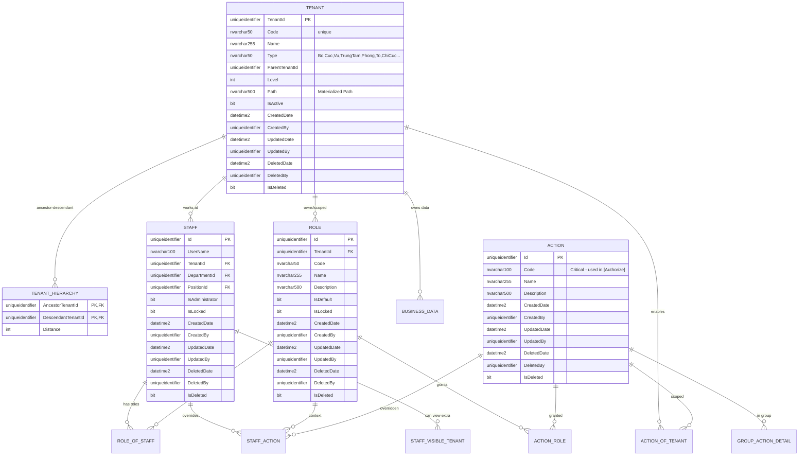

# Báo cáo Thiết kế Database Phân Quyền Mới
**Hệ thống Hierarchical Multi-Tenant với Permission Flow Downward**

**Ngày:** 05/05/2026

---

## 1. Tổng quan

Thiết kế Database mới hỗ trợ mô hình **Hierarchical Multi-Tenant**, cho phép:
- Cấu trúc tổ chức phân cấp: **Bộ → Cục/Vụ/Ủy ban/Tổng cục → Trung tâm/Phòng/Tổ/Chi cục**.
- Quyền **xuống cấp**: Parent được xem dữ liệu của tất cả các cấp con, Child không xem được dữ liệu của Parent.
- Tích hợp mượt mà với mô hình RBAC hiện tại.
- Tất cả ID sử dụng kiểu **uniqueidentifier (Guid)**.
- Thêm Base Entity cho tất cả bảng chính (audit & soft delete).

---

## 2. Các thay đổi chính so với thiết kế cũ

| STT | Thành phần cũ                  | Thành phần mới                          | Mô tả thay đổi |
|-----|--------------------------------|-----------------------------------------|--------------|
| 1   | `Unit` / `UnitId`              | `Tenant` + `TenantId`                   | Đổi tên và nâng cấp thành Tenant hỗ trợ hierarchy |
| 2   | Không có                       | `TenantHierarchy` (Closure Table)       | **Mới** - Hỗ trợ query nhanh cha-con và visible tenants | Không cần thiết trong scope hiện tại |
| 3   | `Action` không có Right        | `Action` giữ nguyên                     | Giữ nguyên, không phụ thuộc Right |
| 4   | `Role.UnitId`                  | `Role.TenantId`                         | Role scoped theo Tenant |
| 5   | `Staff.UnitId`                 | `Staff.TenantId`                        | Staff thuộc Tenant chính |
| 6   | Không có                       | `ACTION_OF_TENANT`                      | Giới hạn Action theo cấp Tenant (tương tự ActionOfUnit cũ) |
| 7   | Materialized Path / ParentId   | `Tenant` có cả `ParentTenantId`, `Level`, `Path` | Hỗ trợ linh hoạt nhiều cách query hierarchy |
| 8   | Không có Base Entity           | Thêm `CreatedDate`, `CreatedBy`, ...    | Audit & Soft Delete |

---

## 3. Sơ đồ Database (ERD)


---

## 4. Sơ đồ Database (ERD)

```mermaid
flowchart TD
    A[Staff Login] --> B{Kiểm tra IsAdministrator?}
    B -->|Có| Z[Full Access - Toàn bộ Tenants]
    B -->|Không| C[Lấy TenantId chính của Staff]

    C --> D[Lấy Visible Tenants\nqua TenantHierarchy]
    D --> E[Lấy Roles qua RoleOfStaff\n(Scoped theo Tenant/Department/Position)]

    E --> F[Lấy Actions từ Action_Role & Action_Of_Tenant]
    F --> G[Áp dụng Override từ Staff_Action]
    G --> H[Tính Effective Permissions]
    H --> I[Filter dữ liệu theo Visible Tenants]
    I --> J[Trả về PermissionModel]
```
